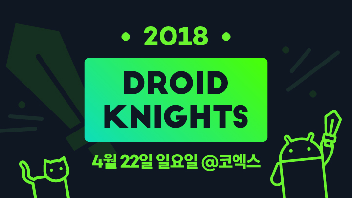

# DroidKnights 2018



- ⏰ 일시 : 2018. 04. 22 (일)
- 💁 주최 : DroidKnights Community
- ⛳ 장소 : 코엑스
- 🔗 링크 : https://droidknights.github.io/2018/

## 👏 총평 

- 나의 첫 개발 컨퍼런스로  지금까지의 나를 있게 해준 고마운 행사.
- 이때 처음 배워서 아직까지도 잘 써먹는 것들이 많다. 여러모로 시야를 트이게 해준 컨퍼런스.
- 2년 뒤에는 나도 발표를 해야겠다고 다짐했는데...

## 📸 인증샷


### 1. No More Fragment, No More Activity	

- 🎤 발표자 : 정승욱

```
왜 단일 액티비티 인가?

액티비티의 수가 QA 포인트와 비례 (이슈, 저사양 기종 별 이슈)

Illegal State Exception  -> 액티비티가 메모리에서 복원 과정에서 나는 이슈

Map Base Application -> 액티비티 생성시 맵 초기화 과정에서 발생하는 높은 리소스 비용 -> 맵을 단일로 접근하자

확장성 문제  -> 기능별 액티비티가 전환될 떄 마다 너무 많은 데이터 교환이 필요함
-> 1개 수정의 수많은 사이드 이펙트 발생

뷰간 데이터 교환 방법
테스터가능한 코드

실제로 구현할 것들
 *State machine과 view Updater
ViewUpdater sm에 전달해주면 다시 뷰업데이터가 뷰에 데이터를 띄워주는
데이터 바인딩을 활용

*라우터와 노드
UX 기반 라우터 테이블
화면 다위를 관리하는 노드

냅 접근성

맵의 단일한 컨트롤러도 접근하여 여러개의 맵픽쳐


익터렉션 대응
백키 액션
다른 액티비티와의 통신
뷰/액티비티 라이프사이클  -> rx/자바 사용, 단 rx라이프사이클 사용 x

**실제 구현
스테이트 머신
외부에서 스테이트 머신 동작 트리거를 따로 둠
상태정보와 상태를 함께 전달할 테디터 정의
던달받은 상태를 기준으로 갱신할 뷰를 정의
상태정보와 새롱누 정보를 바탕으로 뷰를 띄웜

스테이트 머시는 최초 트리거로 시작

스테이트 머신 - 뷰업데이터 - 뷰 - 뷰모델

라우터와 노드를 이용하여 뷰와 뷰모델을 관리하면
트리구조로 뷰를 관리할 수 있다 -> Back키 액션 관리 가능

라우터로 분기 -> 노드로 띄움

라우터 노드 활용의 장점 : UX변경이 필요하면 라우터 테이블 변경

현재노드는 자식 노드만 알 수있게 설정
-> 부모노드는 인터페이스를 통해서만 접근

레이어링 맵
동시에 맵에 접근할 수 있는 인터페이스

액티비티 리절트 매니저
온액티비티 리절트에서 결과를 처리하는게 아니라 리절트 매니저가 받아서
액티비이 온리줌에서 결과를 복원 및 콜백을 호출하게끔

사내용 Android Stuido용 플러그인 개발
라우터 학습 프로젝트

대거 활용
블루라인 랩의 컨덕터
우버의 립느
스퀘어의 코디네이터

굉장히 많은 인터랙션을 발생시키기 때문에

가벼운 앱은 일반적인 MVVM, MVP로 구현

```

### 2. Next Step Architecture

- 🎤 발표자 : 남상균, 정현지

```
Nxt step Archt

캐시슬라이드 - 문화상품권 캐시서비스
6년자 서비스

오래된 앱은 어떻게 새로운 기술을 받아들이고 아키텍쳐를 개선하는가?

아키텍쳐는 개발자만 하는 영역이 아니다
-> 조직, 비지니스, 기술 세가지의 영향을 모두 받는다.
조직 : 개발문화
비즈니스 : 요구사항

1. 개발문화
  애자일, 스크럼, XP
  애자일을 조직문화로만 생각하지만, PO가 어떻게 과제를 선정하는가, 개발자가 어떻게 처리하는가도 중요

  ALGIE
  스크럼
  KANBAN

  MVP - 미니멈, Viable, Product
  :빨리 실패해서 효율적인 실패를 통해 배운다.
  모든 상황에 MVP를 적용할 순 없다 - 요구사항이 아주 명확한 경우 (SI)

  릴리즈 주기를 1주일

  단계적 배포 : 25%씩 나눠서 배포 -

  오레일리 Code Simplicity : 최대한 단순하게 개발하자
  -> 소프트웨어의 목적은 사람들에게 도움을 주는 것이다.
  변경에 대한 바람직한 정도 = ( 현재의 가치 + 미래의 가치 ) / ( 구현을 위한 노력 + 유지를 위한 노력 )

  소프트웨어의 유지를 쉽게 하는 것은 각 부뿐의 단순함에 비례한다.
  구현 < 유지

2. 요구사항
  AD TECH
  B2B 와 B2C를 나눠서 담당

  락스크린에 표현하기 위한 기술 (iOS는 안됨)
  라이프사이클이 다름.
  FOREGROUND로

3. 기술
  오픈소스를 사랑함
  다양한 기술적 시도

  Doing the right Things -> Doing things Right
  완벽한 코드가 아니라 코드가 돌아가게끔 짜는 것.. 코드가 목표는 아님.


실사례
사용자의 취향에 맞는 다양한 서비스 개발
for 캐시슬라이드 - 연결된 서비스
더 키즈 라이프 (라이브 키즈쇼 앱)
5년이상 지속으로 대상서비스가 바뀜 S3 -> S8
필연적으로 새로운 기술 대응

1. 통합로그인
  하나의 계정으로 모든 서비스를 제공
  이메일 - 소셜계쩡 - 캐시슬라이드
  구글 io
  오레오 버전 출시
    백그라룬드 실행 제한 + 위치제한 (배터리)
  MVP & AAC
  코틀린

  AAC
    라이프싸이클, 라이브데이터 뷰모델, 룸
    라이프싸이클과 룸
    라이브러리에 따로 추가할 필요 없이 코어로직에 적용이 쉽다.

  설득의 과정
  JAVA vs 코틀린 -> Production레벨? 속도?
  코틀린 -> 안정성 확보 (공식지원후 1년), 라이브러리 배포
  오픈소스 - 새로운 기술 도입
  LAM 사용에 큰 이슈 발생 - 중국폰에서 안됨 -> 오픈소스와 신기술 신중하게 도입

  차터 - 할일을 정리해서 목록으로

  Critical Pass - 일정에 영향을 가장 크게 미치는

  e-mail

  코틀린 사용 소감 : 적정기술.

  새로운 언어 적용시 3가지 요소 - 교육, 프로토타이핑, 공감
```

### 3. Best Practice on Android Instant Apps

- 🎤 발표자 : 김종식
```
003. 인스턴트 앱

원티드 - 지인추천 헤드헌터 앱

인스턴트앱이란 : 설치없이 바로 실행가능한 앱 - 이후 필요에 따라 네이티브앱 설치

조건 안드로이드스큐디오 3.0
정식 출시 이후
base 앱과 feature 만 있어도 된다.

구글 io에서 정식 제공

4MB라는 용량 제한이 있음
gradle 3.1 포함시 용량 부분에 있어서 많이 줄어듬

data/data/com.googule.android.instantapps.supervisor/files 에 생성된다.

컨텐터 프로바이더나 push는 사용하지 못함

제공 API
inInstantApp()
showInstallPrompt() - set referrer 로 설치이후 네이티브 앱으로 값을 넘길 수도 있다 .

설치과정을 트래킹 하는 것이 중요
- 파이어베이스 코어를 이용하면 어떻게 유입디는지 확인 가능
- 스타트 프롬 URI로
-

배포과정은 동일하나
1. 빌드할 때 설정 확인필요
2. default-url 메타데이터 확인 필요
3. 사이즈 4MB
알파와 베타의 경우에는 10MB까지
4. 홀드백 - ???

인앱브라우저
파이어베이스 다이나믹 링크를 이용하여 롱링크 방식을 이용하여 URL을 사용하면
카카오웹뷰에서도 동일하게 사용가능.

개발 가이드라인
- 사용자의 경험을 설치이전과 설치이후에 동일하게 제공하는 것이 중요.
- 사용자 관점에서 어떤 Feature에 설치이후에 중요한가에 대해 고민.
- 처음부터 인스턴트 앱을 설계하고 공통 로직 빼고 설계하고 출시하면 생각보다 전환이 좋지 않음.
- 빠르게 적용해서 테스트를 해보는 등, 개발싸이클을 굉장히 짧게 잡는 것이 중요. 점진적 개발

g.co/instantapps
tech.wanted.co.kr/

하나의 코드로

```

### 4. 지금은 ConstraintLayout 시대	

- 🎤 발표자 : 안세원


```
004. ConstraintLayout

ConstraintLayout
복잡한 레이아웃을 단순한 계층구조로 표현할 수 있는 뷰그룹
현제 뷰들과 관계를 정의해서 레이아웃을 구성한다는 점은
렐러티브레이아웃과 비슷하지만 보다 유연하고 다양한 기능을 제공함
뎁스를 훨씬 낮출 수 있게 됨.

왜 써야하죠?
훨씬 직관적이고 뎁스가 정말 많이 줄어든다.

ConstraintLayout 1.1 기준

서큘러 포지셔닝. 옵티마이저, Layout editor 는 넘어감.

maven으로 추가

1장 천리길도 뷰하나부터
  Constraint 제약사양들을 가지고 포지션과 사이즈를 잡는 레이아웃
  자식뷰의 사이즈와 기준을 잡음.
  "나의 ~쪽은 부모/누군가의 ~족을 바라볼거야"

  렐러티브와 차이는 렐러티브는 위치는 박아주는 데 비해
  콘스트레인은 기준을 잡아주는 정도이다.

  기왕 할거면 상하좌우(탑,바텀,레프트,라이트)) 다 설정해줘야 가독성 증가

  크기와 위치가 결정되는 방법
    layout_width, layout_height
    100dp, wrap_content, match_constraint(0dp 라고 쓴다.)
    크기를 percent로 부모뷰의 크기에 비례하게 결정 -> 부모뷰에 패딩이 걸려있다면 그것까지 고려
      layout_constraintWidth_default="percent"
      layout_constraintWidth_percent="0.4"
    dimensionRatio : 뷰의 가로세로 비율 결정 (비율을 유지하는 중 가장 큰 사이즈로 설정됨)
      layout_constraintDimensionRatio="1" 가로/세로
      layout_constraintDimensionRatio="1:1" 가로:세로
      "w,1:2" 등으로 w, h에 기준을 잡고 비율을 설정할 수도 있다.
      
```

### 5. Google Mobile Vision과 OpenCV로 card.io를 확장한 범용 카드번호인식 개발

- 🎤 발표자 : 장혁재

```
005. card.io

card.io ->
엠보싱만 인식되고 프린트된 카드는 인식이 안됨.
엠보싱이 없으면 위치 인식이 잘 안되고 8 인식이 잘 안됨.

구글 mobile vision
숫자만 뽑아내기가 너무 어렵고, 오인식이 너무 많음

카드영역 추출 -> card.io 추출
카드번호 위치 찾기 -> 개발
카드번호 인식 -> google mobile vision

OpenCV를 활영하여 복수개의 문자열 위치를 검출
preview 를 이용하여 직접 인식 시도
너무 작은 이미지에서는 문자 인식 불가능
투명색은 이미지로 인식 안함

선명하게 1장이 흔들린 10장보다 인식률이 훨씬 낫다.
CaptureReuslt.FOCUSED_LOCKED

직관적 UI 수정 -> 드래그 쉐도우 + 히든버튼

구글 모바일 비전 학습데이터를 다운받아야 하는데
안드로이드 매니페스트에 저장한다. -> 이후 실행시 저장하는지 확인하는 방법

```

### 7. Travis-ci 를 이용한 CI/CD 와 도커를 이용한 Jenkins for Android 구성하기
- 🎤 발표자 : 장인수

```
006. 젠킨스

CI - 빌드와 테스트를 지속적으로 해주는 툴

필수요소
형상관리 - git
빌드툴 - 그래들, 앤트 등
CI tool : 젠킨스, 트레비스

CI를 구축하지 않는 경우 - 원격서버에 .gitignore
형상관리 서버에 커밋하면 폴링과정을 통해 CI가

** gitignore에 어떤것들이 들어가는지 idea등의 파일들의 의미를 파악하도록 하자.

CI가 잘 적용될 경우
스틱에서 오토로 운전 을 넘어 자율주행하는 느낌
강제 테스트의 폐해 - 테스트코드를 쉽게 짜는 문제가 생김

CD : Continuous Delivery, Continuous Deploy
짧은 주기로 출시하는 SWE적 접근
 = 지속적 배포 (짧은 주기로 개발중인 SW를 배포하고, 그 과정을 자동화)

github에 릴리즈 탭을 이용.

CD를 구축한 경우 : CI서버에서 테스트가 성공하면

트래비스 (https://travis-ci.org/)
- 깃허브에서 진행되는 오픈소스 프로젝트를 위한 지속적 통합.
- 관리가 필용벗는 무료 클라우드 기반 호스팅.
- 리눅스, 맥에서 동시에 테스트 할 수 있음.
- 안드로이드 포함
- 깃허브와 seamless한 통합
- 오픈소스 한정 무료

트래비스의 단점
- 제한된 옵션 제공
- 좀 느린 속도 및 성능

젠킨스
- 무료
- 도커로 설치 가능
- 다양한 플러그인

젠킨스의 단점
- 별도의 서버가 필요
- 시스템 구성 및 사용자 정의 시간이 오래 걸림
 -> 단점들은 도커로 해결 가능

젠킨스용 도커를 클론으로 받은 뒤
openJDK -> UBUNTU
add Gradle
add AndroidSDK

```

### 8. 내가 안드로이드 개발자가 되었을 때 아무도 알려주지 않은 것들
- 🎤 발표자 : 강사룡
