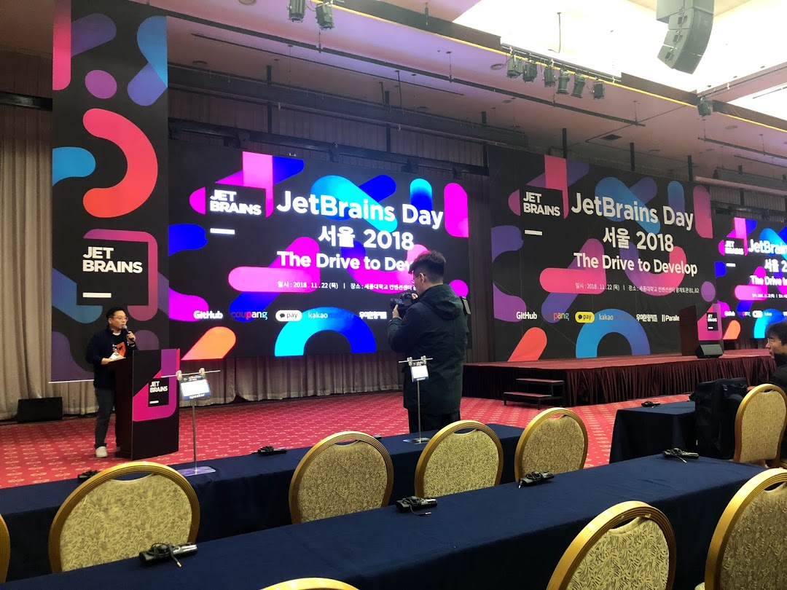

# JetBrains Day 2018 - The Drive to Develop


- ⏰ 일시 : 2018. 11. 22 (목)
- 💁 주최 : JetBrains
- ⛳ 장소 : 세종대학교 컨벤션센터
- 🔗 링크 : https://jetbrains.tangunsoft.com/_kr/jetbrains-day-seoul-2018/

## 👏 총평 

- 갓브레인즈 찬양해
- 해외의 개발자 중심 기업이 어떤 식으로 업무를 하는지 엿볼 수 있는 귀중한 기회였다고 생각한다.
- '*Eat your own dog food.*'에 대해 다시 한번 생각해보게 되었다.

## 📸 인증샷



## 1. 키노트 (Removing barriers)

```
젯브레인은 어떻게 일을 하는가?
스스로에게 필요한 제품을 생산한다.

계층에 대해서
- 누구나 무엇에 대해서든 말할 수 있는 목소리를 가져야 한다.
(마케팅 부서가 아니라도 마케팅에 대해서 말할 수 있어야 한다.
군영권이 없는 일반 직원도 운영에 대해 말할 수 있어야 한다.)

무엇이든 언제든 어떻게든 하고 싶은 일을 해라
그리고 완성해라?- 해라?
- 물론 파라다이스는 아니다
 1. 업무 시간의 장벽을 무너뜨려라
  - 어짜피 지역별로 시차로 인해 근무시간이 전부 다름
  - rules of engagement
   1. 미팅에는 와라
   2. Bavaria가 아니라면 일요일엔 일하지 마라

 2. 미팅에 관하여
 - 아무도 나쁜 미팅을 원하지 않는다.
 - 미팅에는 목적과 카테고리가 있다.
 - 미팅의 조정 cordination
  1. 하나의 안건(토픽)
  2. 액션 아이템
   - 회의가 끝나고 나왔을 때 '해야 할 목록이 나와야만 한다.'
 - Standups
  무엇을 위함인가? 소통? 신뢰?
  대안 : 트래킹 툴, Logging Standups

 3. 누가 누구인가?
  - traineer 플러그인
  - 누가 무엇을 하는지 알아야 하는 순간이 온다. (누군가 같은 작업을 한다면?)
  - 서로의 업무 바운더리를 지켜야 함.

  소통하는 방법
  이메일을 줄여라
  이슈 트래커를 써라
  슬랙 - 너무 많은 알림, 아주 중요한거 아니면 막 쓰지 말라

 PUSH AND PULL
 - 정보를 너무 많이 푸시하면 아무도 안볼 것이다.
 - 문서화를 통해 동료들이 원할 때 원하는 정보를 가져가도록 한다.

 Internal newsletter
 Internal conference  -> Technical Wednesday's -> Jettles?

 Managements
 - no mirco-management
 - no micro-reporting
 - no permissions required (no layer to do somehitng)

 목표를 가지고 일하기
 - series of goals
 - provide guidance
 - remove obstaclse

 자유롭게 일하라 - 자유에는 대가가 따른다
 그럼 무엇이 필요한가?
 - 자가 정리 self-organisation
 - 규율
 - 책임감

 - 어떻게 우선순위를 정하는가
 - '안돼'라고 말하는법
 - 열정을 측정하는 법을 알기

 questioning if what you're doing adds value

 모두가 자유로우면 무엇이 리더쉽인가?
 - not being a bottleneck
 - Learning to delegate (이거해라 하지마라는 쉽다. 어떻게 하라 라고 가이드해주긴 어렵다.)
 - Providing guidacne
 - Being candid
 - knowing how to listen and be heard

 don't moan up cooper steps

```

## 2. 키노트 (소프트웨어를 모르는 대한민국 기업의 위기)

- 🎤 발표자 : 안영회

```
2기조연설
소프트웨어를 모르는 대한미눅 기업의 위기

마소가 개발자 전용 서비스(깃헙)를 인수한 사건

개발자가 아닌 사람은 이것을 어떻게 받아드릴까?

깃헙 인수 가격 8조 = 노키아 8조 = 홈플러스 8조
VS SW자동개발화 추진
: 한국형 개발이라는 우물에 빠진 것은 아닌가?
```

## 3. What's new in Kotlin

- 🎤 발표자 : Hadi Hariri

```
annotaion에서도 enum 사용 가능

inLine 클래스, 메소드
인라인 함수 : 람다, 함수를 복사해다가 붙여준다.  C의 DEFINE과 같은 역할이라고 보면 된다.

return@forEach

crossInline

experimental -> 베타서비스
```

## 4. IntelliJ tip and ticks

- 🎤 발표자 : Hadi Hariri

```
툴박스 (무료)

탭 대신 네비게이션 옵션
더블 컨트롤 -> 뭐든지 구동 가능
  run configuration

Live templates
 ->
스마트 컴플리션
not null

히피컴플리션 hippeCompletion
쉬프트커맨드 엔터 -> 커서가 어디있든지간에 문장을 끝낸다.

json 알트엔터 -> json 선택
어노테이션 @Language("JSON")
정규식으로 선택할 경우 맞는지 아닌지까지 검증 가능

ideaVim (PlugIn)
AceJump (Plugin) : 무언가를 빨리 거색하ㅣㄱ 위한 기능

알트+방향키로 원하는 부분 선택

abbriviation 으로 단축키 없이도 네비게이션으로 찾을 수 있다.

데이터 타입 뿐만 아니라 조건, int의 경우
inspection으로 코드베이스로 잠재적 버그들을 찾아준다.
 -> 스트럭쳐럴 서치도 추가하여 특정 구조의 코드를 하이라이트 해줄 수 있다.
 -> 리플레이스까지 가능하다.

structural search -> 특정 구조의 코드를 찾아준다.

여러줄의 함수를 한주렝 쓴 상태에서 디버깅 할 때:
 Stream.of(words).distnct
Trace Bug :  stream trace 를 가느앟게 해줌
JAVA8 이상 Stream API 적용 시 사용 간으

ThrowExcpetion Debugging  -> 디버깅 중 익셉션 날릴 수 있음

duplicate

replaceInheritanceDeligation

Test restful webservice (deprecated)

test.http
```
