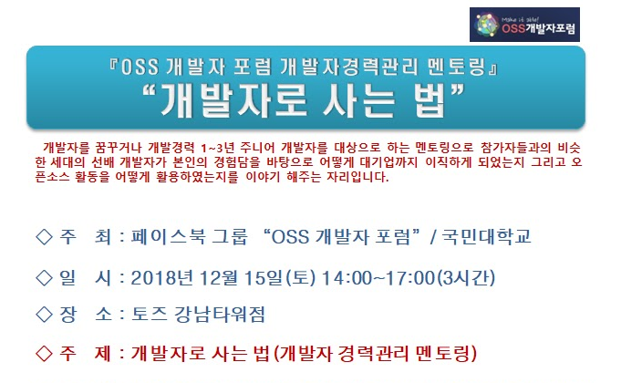
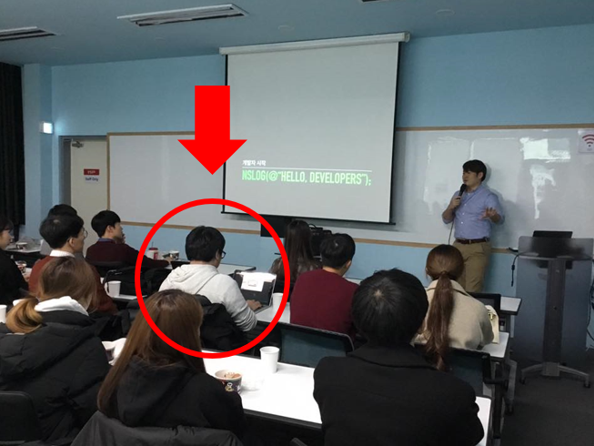

# OSS개발자포럼 개발자 경력관리 멘토링 "개발자로 살아남는 법"

- ⏰ 일시 : 2018. 12. 15 (토)
- 💁 주최 : OSS 개발자 포럼 
- ⛳ 장소 : 토즈 강남점
- 🔗 링크 : https://lh3.googleusercontent.com/ifIg7RMlenQnUjUTsDBzLgQ1qmYaoGUbQ8f0YQ2IX2sCc670ee_r_8ol5onFn-F8jCaLuhdAm54iJywffskC1haUmWbHgaUObSSqIhSE7r9t0-3tBIl4zpLPZEvE=w705

## 👏 총평 

- 개발자 커리어 측면에서의 '오픈소스 활동의 효과'를 배울 수 있는 자리였다.
- 권문범 멘토님께는 이후에도 개인적으로 도움을 많이 받았다. 감사합니다!

## 📸 인증샷

> 빨간 화살표가 나다.