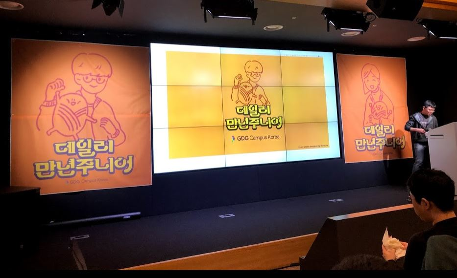
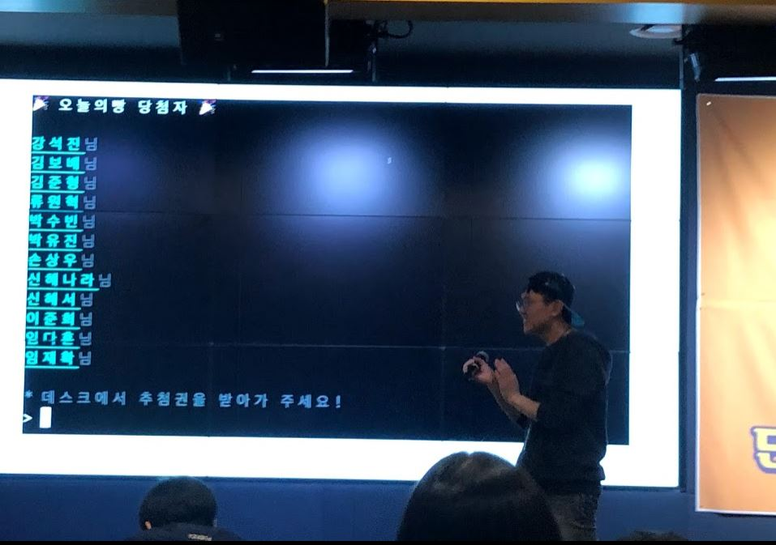

# Daily 만년 Junior들의 이야기 : 델리만주


- ⏰ 일시 : 2019. 02. 16 (토)
- 💁 주최 : GDG Campus Korea
- ⛳ 장소 : Google for Startups Campus : Seoul
- 🔗 링크 : https://festa.io/events/192

## 👏 총평 

- 주니어 개발자로서 성장하기 위한 여러가지 방법들을 들을 수 있었다.
- 의외로 돌이켜보면 옥찬호님의 대학원 테크 이야이가 가장 인상 깊었다. 랭귀지나 도메인이나 스택이나 전부 다르지만 그래서 신선하기도 했고 '성장의 정석'이라는 느낌도 들었기 때문인 것 같다. 나도 나중에 꼭 책 번역을 해봐야지.
- 사실 학생들이 듣기에 좋은 내용들이 더 많았던 것 같기도 하다.

## 📸 인증샷



> 평생 이런거 당첨되어 본적이 없는데 이번 행사에서 당첨되어 스벅쿠폰을 받았다!

## 메모
```
우아한 형제들 강경완

SW 마에스트로 - 대한민국 SW인재 육성 정부지원 사업 (왜 이런걸 안해봤을까?)

학교에서 배우는 것들
- 언어, SW공학, 디지털회로

개인적으로 써본 것들
- 안드로이드, nodejs, html5 등..

clean code : 추천도서

컴퓨터를 알아야 한다...

기획 안돼요, 디자인 안돼요.... -> 안되는건 없어요...

시각장애인 보이스오버 접근성... -> 우리는? 안드로이드도?
```

```
발표자 태재영 지그재그

관리자 백오피스 웹을 모바일 웹으로 가져오는데서 문제가 생김
디자이너 없이 프로토타이핑??

오픈소스 디자인 프레임워크들이 많음 : 특정 플랫폼에 맞게 미리 만들어진 컴포넌트들

리액트기반 디자인 프레임워크 중 머태리얼 디자인 선택
: 모바일 페이지를 고려했기 때문
: 구글에 대한 신뢰

폴더가 누락되어 머태리얼 디자인 깃헙레포에 이슈등록

```

```
발표자 하조은

내가 무얼 모르는지, 무얼 아는지 아는 것이 중요하다.
-> 나는 무엇을 모르고 있는가?
-> 무엇을 알아야 하는가?

```