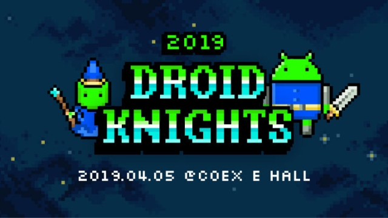
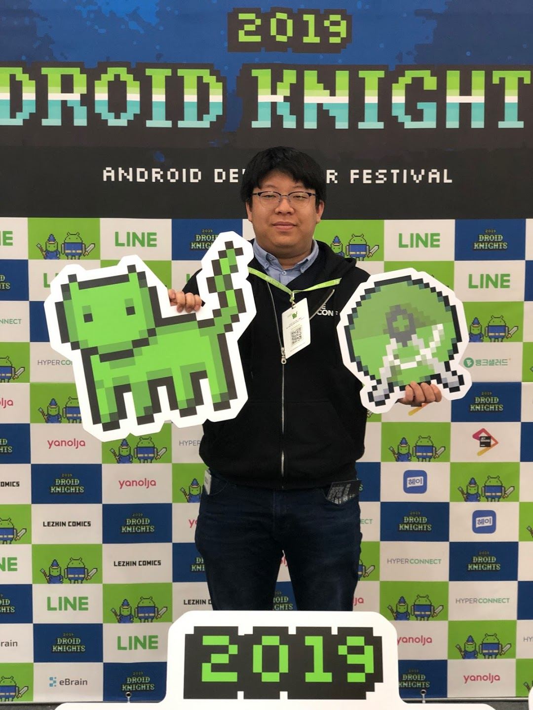

# DroidKnights 2019



- ⏰ 일시 : 2019. 04. 05 (금)
- 💁 주최 : DroidKnights Community
- ⛳ 장소 : 코엑스
- 🔗 링크 : https://droidknights.github.io/2019/
- 📽️ 영상 : [발표 다시보기](https://www.youtube.com/watch?v=rKP2XL8YxMo&list=PLu8dnNjU2FmuGAGjExmVqsEnPuL-8alT2)

## 👏 총평 

- 작년보다 한층 더 재밌고 유익해진 드로이드나이츠!
- 트랙3개 모두 다 듣고싶은 내용들이어서 고르기가 괴로울 정도로 내용들이 전부 알찬 내용들이었다.

## 📸 인증샷



## 1. RxJava 구독과 구독 제거 메커니즘 설명

- 🎤 발표자 : 노재춘

```
구독 제거를 하는 이유 :
무한 이벤트 스트림으로 인한 메모리 누수 방지
```

## 2. Android Project with Multi Module

- 🎤 발표자 : 장선옥

```
글로벌교육앱 콴다

빠르게 개발 -> 다양한 모듈화로 개발
모듈단위로 추가, 삭제가 빠름

모듈이란?
프로젝트를 별개의 기능 단위로 분할
모듈간 종속성

라이브러리와 안드로이드모듈의 차이 :
안드로이드 라이브러리 : AAR

안드로이드 앱모듈 -> apk
안드로이드 라이브러리 -> aar
자바 라이브러리 -> jar

특정 기능에 대한 데모가 필요할 경우
특정 기능데 대한 모듈을 만들고 이 모듈을 종속받는 데모앱을 따로 생성
이후 상용이 될 쯤

1. 기능이 너무 크거나
2. 다른 앱에서 사용가능성이 있을 때 (또는 해당 기능으로 새로운 앱을 만들 수 있을 것 같을 때)
3. 기존앱이 너무 무거울 때

코드의 재사용성
의존성 적은 코드
모듈단위의 코드 수정 용이

빌드시간을 늘리게 되는 요소들 :
모듈간의 종속성이 복잡해 질 수록 빌드시간이 늘아남 (하위모듈 수정으로인한 상위 모듈 재빌드)
어노테이션 프로세서를 (버터나이프, 대거) 사용할 경우

잘 변하지 않는 기능과 독립적인 기능을 모듈로 나누면 좋음
```

## 3. Clean Architecture (in Android) Revised

- 🎤 발표자 : 황성현


```
Android Application
iOS Application
Web Application
Server App
... Application

[Use Case] [Platform = I/O Channel] Application
ex) TODO Android Application

Use case가 아무래도 플랫폼보다는 더 중요하지 않을까?
-> is my use-case code bound to Platform? 유스케이스 코드가 내 플랫폼에 종속적이진 않은가?
->

Architecture is about intent, not framework --Uncle Bob


쇼핑몰에서 상품을 구매하는 유스케이스

인터페이스 어댑터 레이어 : 외부세계의 (네트워크 db등)로부터
데이터를 받아오는 "프레젠테이션 레이어"를 이용하여
비즈니스로직과 느슨하게 결합
(= 엔티티 게이트웨이)

Entity
비즈니스로직 객체?

Separate Business Logic form the Changeable
:바뀔 수 있는 모든 것을 비즈니스 로직으로 부터 분리하라.
:유스케이스(비지니스로직 또는 서비스기획)의 수정이 없는데 유스케이스 코드가 수정되면 안됨
:sqlite 를 realm으로 바꿀 때 DB코드가 아닌 uscecase코드가 변한다면 클린아키텍쳐가 아님!


tao

UI 수정, 플랫폼 수정 등에 따른 코드 수정으로 부터 비즈니스로직을 지킬 수 있다.
-> 테스트 가능

클린아키텍쳐가 MVP/MVVM 보다 낫다?
-> MVP, MVVM 은 전체 아키텍쳐라 아닌 presentaion 레이어의 구현
-> 클린아키텍쳐에 MVP, MVVM

클린아키텍쳐는 클린하다?
-> 엉클밥은 클린성애자
-> 코드베이스 가독성은 일부 떨어질 수 있음.

클린아키텍쳐는 모던한 디자인이 아니다? (옛날 디자인이다)
->

클린아키텍쳐와 DDD와의 관계?
-> 모두 궁극적으로 원하는 방향이 비슷하기 때문 (도메인, 유스케이스 보호)
-> 서로 다름
```

## 4. Kotlin 꼭 해야하나요?

- 🎤 발표자 : 박상권


```
2017년 Google I/O 공식언어로 지정

구글 내에서도 안드로이드 공식언어로 개발 중
공식문서도 전부 코틀린으로 제공
안드로이드 공식 예제코드도 100% 코틀린으로 제공

@layoutres

google kotlin cheat sheet
```

## 7. Android Gradle Plugin 버그잡기

- 🎤 발표자 : 차영호

```
앱 크래시
:apk에 리소스가 빠짐
:proguard Relase Build에서만 오류 발생
:코드를 줄이면 멀쩡해짐
:프로가드 룰을 조정하면 멀쩡해짐

프로가드 아웃풋 jar 에는 리소스파일이 정상적으로 들어있음

그 이후 작업 내역을 확인

안드로이드 프로젝트를 빌드하는데는 gradle 뿐 아니라
Android gradle plugin (AGP)가 필요하고
AGP는 오픈소스 (AOSP)로 공개되어 있다.

AOSP
안드로이드 관련 오픈소스 프로젝트
Android OS, ToolChain, (SDK, NDK...), suuport library, ADT, Doc 등...

AGP를 로컬PC에 설치한 다음
root build.gradle에 로컬 메이븐으로 설정하고
디펜던시에 gradle을 저장한 버전(3.3.0-dev)으로 지정해주면
로컬에 설치한 AGP를 이용하여 빌드할 수 있다.

Zip파일에는 65536 이상의 파일을 가질 수 없다 (파일 갯수를 나타내는게 2바이트이기 때문)

Report Android Issue : (http://b.android.com/)
```

## 8. Advanced MVP

- 🎤 발표자 : 박미륵
```
MVP를 사용하면서 겪은 실수들에 대한 경험담과 리팩토링 과정

View:
View 의 코드량이 점점 늘어남 -> passive 하게 작성 (ui와 로직분리 및 유닛테스트 용이)
어떻게 패시브하게?


프레젠터 :
테스트 코드 작성이 잘 안된다
프레젠터가 너무 비대해지는 것 같다.

-> 프레젠터에 안드로이드 종속성이 있으면 안된다.
-> 프레젠터가 비대하지지 않기 위해서는 로직의 분리가 필요하다

ui로직과 비즈니스/도메인 로직의 분리
-> 프레젠터는 ui로직만
-> 모델이 비즈니스/도메인 로직만

Model
repository
usecase 에 있어야 하는 (테스트되어야 하는) 로직은 레포지토리에 있으면 안된다.
-> 그렇지 않으면 레포지토리에 안드로이드api의존성으로 인해 유즈케이스에 대하 ㄴ테스트가 불가능해짐

UnitTest
테스트코드의 유지보수가 어려움
-> 코드하나만 바뀌어도 테스트코드 전부 수정
-> 의미없는 객체 계속 생성

의미없는 객체, 변수를 왜 생성해야 하는가?
-> 프레젠터는 객체가 어떤놈이든 애초에 보지 않고 신경쓰지 않고, 신경써서도 안됐기 때문
```