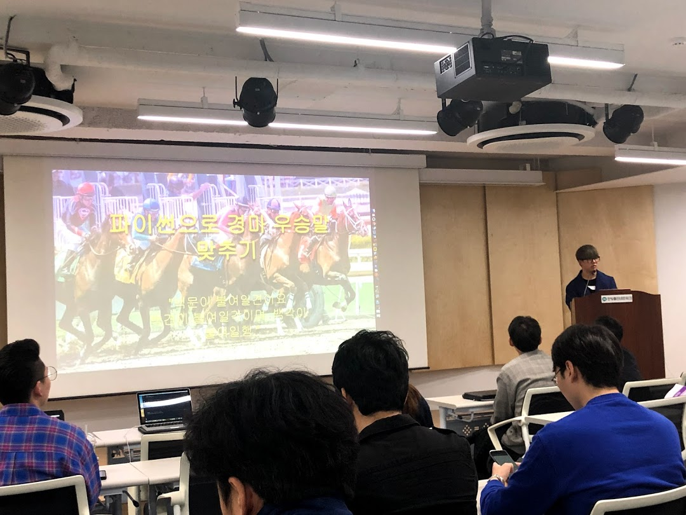

# 4월 파이썬 격월 세미나 : Beat The Stress!


- ⏰ 일시 : 2019. 04. 20 (토)
- 💁 주최 : 파이콘 한국 준비위원회
- ⛳ 장소 : 한빛미디어 리더스홀
- 🔗 링크 : https://festa.io/events/244

## 👏 총평 

- 파이썬의 가능성과 활용방법을 직접 느껴볼 수 있었던 행사.
- 이 행사에서 배운 내용이 바탕이 되어 3개월 쯤 뒤에 [점심당직알림 서비스](https://github.com/HaenaraShin/Lunch_Shift_Alert_SMS_Sender)를 설계하게 된다.

## 📸 인증샷




## 메모
```
찍어내자
정겨울 뱅크샐러드

마이크로서비스 아키텍쳐 파이썬

cookiecutter 라이브러리

스타일가이드를 설정하고 템플릿을 설정

```

```
하기 귀찮은 일 이제 효도는 봇으로
이현호 와디즈

추석에 해외로 가족여행

비행기표를 찾아서 알려주는 카톡봇 개발

셀레니움 (웹드라이버) 를 이용하여 원하는 데이터 긁어오기
-> 스카이스캐너(항공권사이트)에서 봇인걸 바로 걸림

트립닷컴으로 가니까 안걸림

데이터를 전달 해줄 서버를 django 로 개발
AWS? 개인서버?

pythoneverywhere

카카오i 오픈빌더로 카톡 챗봇 개발
```

```
CI? CD? 파이썬으로 간단하게 자동배포 만들어보기
김태욱 트로스트
```
