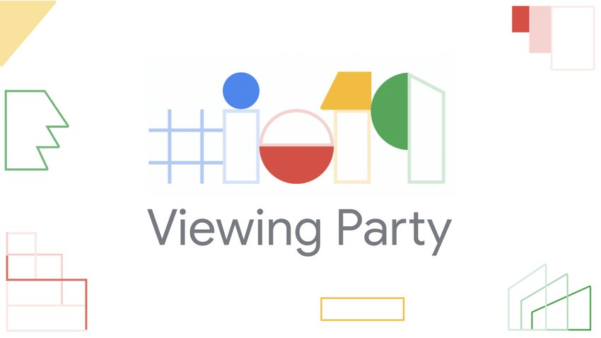
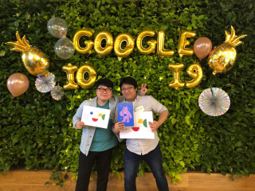

# Google I/O Viewing Party 2019

- ⏰ 일시 : 2019. 05. 07 (화)
- 💁 주최 : GDG Korea Android
- ⛳ 장소 : 우아한형제들 작은집 7층
- 🔗 링크 : https://festa.io/events/263

## 👏 총평 

- 네트워킹을 통해 주변 개발자들을 많이 알게 된 계기가 되었다.
- 구글이 기술적으로 지향하고 있는 가치가 무엇인지 확실히 와닿게 되는 계기가 되었다.
- 나중엔 나도 꼭 미국가서 봐야지!

## 📸 인증샷

## 메모

네트워킹 자체만으로도 충분히 가치가 있었지만 영상이 다 공개되지만 굳이 뷰잉파티 가서 보는 것이 무슨 의미가 있을까 싶었는데 가서 보니 확실히 다르더라... 영상은 나중에 미루다 안보게 되거든...

이번 키워드는 세가지였다. AI, 실시간 통역, 접근성

모든 서비스와 기술이 AI로 귀결되고 그 시작이 Live Caption 기능이 아닐까 싶다. AI 기술을 다루기 위한 HW, SW 측면에서 효용곡선의 타협점을 찾아나가고 있다는 생각이 들었다.

Live Caption이 매력적이긴 한데 한국어로는 잘 지원될까? 싶은 부분은 있다.

생각보다 접근성에도 고민을 많이 하고 있다는 걸 느꼈다.

장애라는 것이 영구적인 것 뿐 아니라 일상 속의 일시적인 상태(회의중에 전화통화를 할 수 없다던가) 하는 것 조차도 장애로 받아들여서 개선한다는 점도 놀라웠다.

중간중간 빵터지는 조크들이 있었다.
안드로이드Q 소개 마지막에 in queue... Thank Q.. 라던가
픽셀의 Purple-ish 라던가...