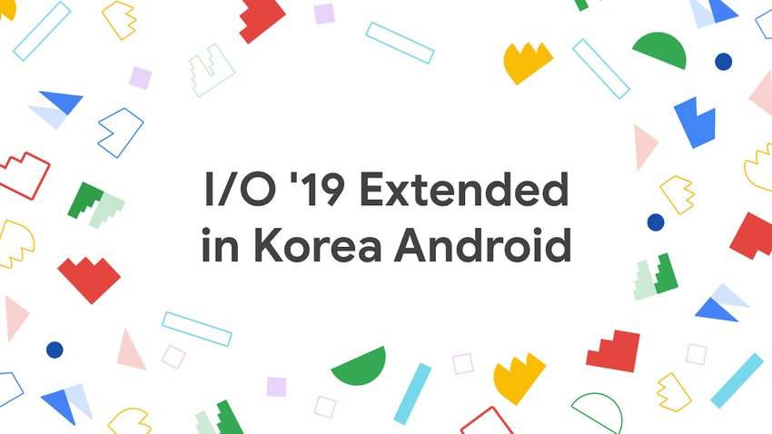
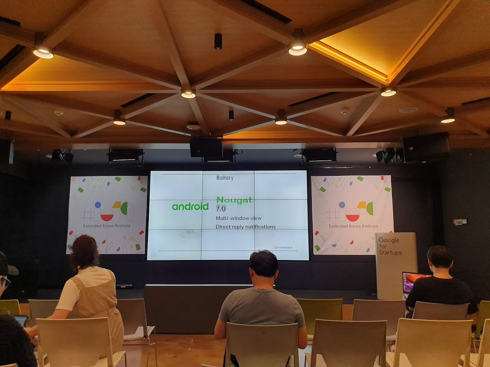

# I/O 19 Extended in Korea Android

- ⏰ 일시 : 2019. 06. 15 (토)
- 💁 주최 : GDG Korea Android
- ⛳ 장소 : 구글 스타트업 캠퍼스 서울
- 🔗 링크 : https://festa.io/events/300

## 👏 총평 

- Google I/O Extended Seoul보다 더 재밌었던것 같다.
- 이 날 뱅크샐러드 자체 컨퍼런스인 콘샐러드와 일정이 겹쳐서 인원이 좀 빠졌던 것 같다. 개인적으로는 이쪽이 더 나을 것 같아서 나는 여기로 참석했지만..

## 📸 인증샷

## 1. 새로운 안드로이드 훑어보기

- 🎤 발표자 : 노현석
- 📎 발표자료 : [다운로드](https://speakerdeck.com/pluu/o-19-extended-in-korea-android-whats-new-in-android)

## 2. Kotlin Under the Hood

- 🎤 발표자 : 도창욱
- 📎 발표자료 : [다운로드](https://speakerdeck.com/cwdoh/hey-kotlin-how-it-works)

## 3. Android Accessibility

- 🎤 발표자 : 강경완
- 📎 발표자료 : [다운로드](https://www.slideshare.net/ssuser3e521c/android-accessibility-for-everyone-150567515)

## 4. Privacy Changes in Android Q

- 🎤 발표자 : 하동현
- 📎 발표자료 : [다운로드](https://speakerdeck.com/hadonghyun/privacy-changes-in-android-q)

## 5. What's New in Shared Storage 

- 🎤 발표자 : 안명욱
- 📎 발표자료 : [다운로드](https://www.slideshare.net/myungwookahn/io-19-extended-in-korea-android-whats-new-in-shared-storage)

## 6. Flutter ❤️ ML Kit

- 🎤 발표자 : 조셩윤
- 📎 발표자료 : [다운로드](https://www.slideshare.net/ssuserf65996/io-19-extended-android-fluttermlkit)