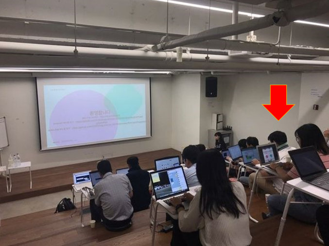

# [AUSG 초보자를 위한 AWS 뿌시기] 실시간 채팅 자음퀴즈 앱 만들기

![[AUSG 초보자를 위한 AWS 뿌시기] 실시간 채팅 자음퀴즈 앱 만들기](image.jpeg)

- ⏰ 일시 : 2019. 06. 24(월), 2019. 06. 26 (수)
- 💁 주최 : AWSKRUG - AWS한국사용자모임
- ⛳ 장소 : 강남 메가존
- 🔗 링크 : https://www.meetup.com/ko-KR/awskrug/events/262569597/

## 👏 총평 

- 안드로이드만 파던 나에게 새로운 시야를 트이게 해준 귀중한 행사.
- 사실 AWS는 미지의 영역이었는데 이 행사를 통해 최소한 개념정도는 이해할 수 있게 되었다.
- 이 경험을 바탕으로 개인적으로도 서비스를 한번 구성해보고 싶다.

## 📸 인증샷

> 빨간 화살표가 나다.

## 메모

두번에 걸쳐서 진행된 행사인데 두번 다 참석하면 참가비용을 전액 페이백해주는 아주 고마운 행사였다.

AWS를 이용하여 서버단은 Node.js로 서버리스 람다 api를 구성하고 안드로이드에서 단순히 호출만 하는 정도의 서비스 개발을 해본 경험이었다.

비록 모든 내용을 이해해가며 진행한 것은 아니지만, AWS를 이용하여 서비스 백단을 직접 구성해보고 어떤식으로 서비스가 이루어 지고 모니터링 하는 지 직접 체험해보기 때문에 굉장히 의미있는 시간이었다고 생각한다.

덤으로 행사 진행하신 분이 너무 젊은 분이셔서 많이 반성했다... 나는 학부생때 뭐했지?