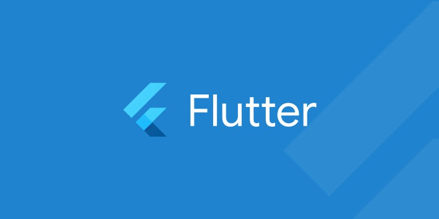

# 만들면서 배우는 Flutter 코드랩

- ⏰ 일시 : 2019. 06. 29 (토)
- 💁 주최 : 조은
- ⛳ 장소 : 구글 스타트업 캠퍼스
- 🔗 링크 : https://festa.io/events/319

## 👏 총평 

- 한동안 나에게 플러터 뽕을 주입했던 행사.
- 확실히 개발자는 코드랩을 통해서 빨리 배울 수 있다는 것을 경험할 수 있었다.
- 조은님을 처음 뵌 행사였다.

## 📸 인증샷

