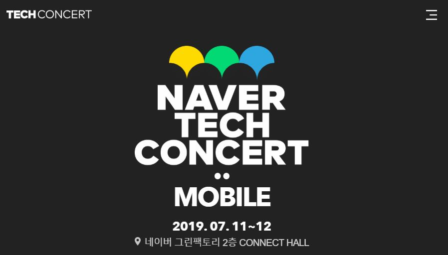

# NAVER TECH CONCERT 2019 : Android



- ⏰ 일시 : 2019. 07. 11 (목)
- 💁 주최 : NAVER
- ⛳ 장소 : 네이버 그린팩토리
- 🔗 링크 : http://techcon.naver.com/

## 👏 총평 

- 작년에 이어 기본이지만 핵심인 내용들이 많아서 도움이 많이 되었다.
- 작년보다 대상 경력층이 낮아져 학생위주로 초점이 맞춰진 것 같은 느낌이 들긴 했다.
- 두번째 세션인 *'예제에서 알려주지 않는 모델 이야기'* 는 정말 도움이 많이 되었다.

## 📸 인증샷


> 각도의 중요성

## 1. 안드로이드 스튜디오 세팅 다시하기

- 🎤 발표자 : 노현석 네이버
- 📽️ 발표 영상 : [영상 링크](https://tv.naver.com/v/9329709)

```
Quick Lists
- Gradle Sycn, Split 기능 등을 추가하여 쓸 수 있다. 

Keymap
- 퀵리스트를 키맵에 추가할 수 있다.

Notification
- 보이스오버 기능도 있다. 
- 켜고 끌 수 있다.

FileColor
- 프로젝트 뷰에서 그래들, 테스트 등이 하이라이티드 된 컬러를 의미.
- ProductFlavor에 따라 색을 설정할 수도 있다. 

Reformat code
- commit 에서도 reformat을 설정할 수도 있다. 
- Editor > inspection > Kotlin > "file is not formatted"을 설정하면 확인할 수 있다.
- 어노테이션 //@formatter:off 로 포매터를 막을 수 있다. 

breakPoint
- preference > debug > 컨디션이 있는경우 삭제할 때 확인팝업을 띄울 수 있는 설정이 있다.

Language
- 프리퍼런스 > language injection > advanced > add aonntation 자동 설정 

layout edditor 
- 프리퍼런스 > 레이아웃 에디터 > 프리퍼 xml


라이브템플릿
- 프리퍼런스 > 라이브 텝플릿 > + > 단축키 와 템플릿 추가
- 레이아웃도 가능 : 
- 포커스에 맞춰서 사용하는 것도 가능
- 커스텀뷰 등을 탬플릿에 추가하여 한번에 생성할 수도 있다.

프리퍼런스 > 시스템세팅 > 메모리 세팅 으로 메모리 확장 가능
플러그인 불필요한 기능들을 전부 뺀다.
```

## 2. 예제에서 알려주지 않는 모델 이야기

- 🎤 발표자 : 김범준 뱅크샐러드
- 📎 발표자료 : [다운로드](https://www.slideshare.net/NaverEngineering/techcon-2019-mobile-android-model)
- 📽️ 발표 영상 : [영상 링크](https://tv.naver.com/v/9329728)

```
Model 
역할 분리 (책임)에 따른 분리과정


1. 레포지토리 패턴

레포지토리패턴 : 하나의 레포는 하나의 도메인
추상화를 이용하여 (인터페이스)를 가지고 데이터를 불러오는 로직을 분리하여 관리
-> 테스트가 용이

2. 비즈니스 로직을 분리 branch:model_V2
비즈니스 로직이란? : 사용자의 사용 목적

프레젠테이션 레이어가 너무 비대해지는 것을 막기 위해

서비스 : 
서비스레이어 패턴 (n-tier, 3-layer에서 파생)
비즈니스로직의 집합소 개념, 재사용이 용이하다.
MSA에 유용
설계가 짜임새가 되어 있어야 한다.
완벽하게 프레젠테이션에서 분리하기 어렵기 때문


UseCase:
하나의 유저행동에 대한 서비스(Applicatoin)의 비지니스로직이 담겨있는 객체
서로(UseCase)에게 독립적
유지보수, 변경이 유리
* 유저의 행동(비즈니스 로직)과 1:1 매칭

3. exception_handling 
프레젠터의 익셉션 핸들이 비즈니스로직인 이유 
:httpException, 403코드 체킹은 Presenstation로직이 아니다.
:유저의 행동에 따라 발생하는 예외 상황이기 때문에 BusinessLogic이 아니다.
```

## 3. 안드로이드 개발자 로드맵

- 🎤발표자 : 안중환 네이버 웹툰
- 📎 발표자료 : [다운로드](https://www.slideshare.net/NaverEngineering/techcon-2019-mobile-android3)
- 📽️ 발표 영상 : [영상 링크](https://tv.naver.com/v/9329737)

```
안드로이드 트레이닝 코스, 코드랩
코드패스 안드로이드 클리프노트

툴즈 > 레이아웃 인스펙터

프래그먼트 대신 뷰를 재활용 단위로 가져가면
프래그먼트 다이얼로그프래그먼트, 뷰홀더 등에 재활용 가능하다.

책 : 자바 병렬프로그래밍
책 : 이피셔느 안드로이드

안드로이드 초당 60프레임 : 16ms 단위로 

개발자옵션 프로필 GPU 렌더링

안드로이드 퍼포먼스 패턴즈 
책 : 안들이드 앱 성능 최적화 

AOSP 
책 : 인사이드 안드로이드

책 : 클린소프트웨어
책 : 실용주의 디자인 패턴

OOP 5대 원칙
Source Making : 디자인패턴의 

책 : Functional Thinking 
책 : 클린코드, 클린아키텍쳐, 리팩토링

책 : 클린코더
```

## 4. 나누고 쪼개지는 안드로이드

- 발표자 : 양찬석 Google
- 📎 발표자료 : [다운로드](https://www.slideshare.net/NaverEngineering/techcon-2019-mobile-android4)
- 📽️ 발표 영상 : [영상 링크](https://tv.naver.com/v/9329746)

```
안드로이드 프레임워크를 쪼개는 방법

:안드로이드의 미래?

안드로이드의 철학 4가지 
오픈소스 
모든앱은 동일하다
앱의 경계를 넘어
빠르고 쉬운 앱 개발 

다이앤 핵본 : 안드로이드의 대모

사용자가 앱을 종료할 필요가 없음
메모리 사용량을 최소화
앱 실행 및 다른 앱으로 전환이 빨라야 함
선탑재되는 앱과 동일한 수준의 API제공

4대 컴포넌트 = Entry Point = 메인함수 = 앱을 시작하는 방법
: 왜 4가지 다른 시작방법?
-> 사용자에게 UI를 제공, 백그라운드에서 작업 수행, 특정 이벤트에 반응, 데이터를 제공

platform APIs 를 제공하는 것으로 24000대의 디바이스 호환성 확보
CDD, CTS
```
