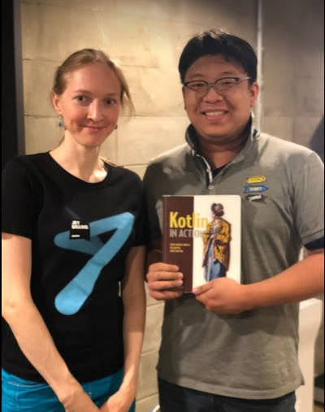

# Kotlin/Everywhere Seoul 2019


- ⏰ 일시 : 2019. 08. 26 (월)
- 💁 주최 : GDG SEOUL
- ⛳ 장소 : 역삼 마루180
- 🔗 링크 : https://festa.io/events/422

## 👏 총평 

- 나의 코틀린 학습의 당근과 채찍질이 되어준 행사.

## 📸 인증샷



> Kotlin in Action 저자 스베트라나 이사코바님과 한장 찰칵!

## 메모
```
코틀린

6년동안 stable 과정을 거침

오늘의 아젠다 : 코틀린 에볼루션, 실험적 기능

Principle of PRagmatic Evolution

KEEPing the language modern
Kotlin Evolution and Enhancement Process

Comfortable updates : 
Deprecation warnings in advance
Automatic migration


Read-only 와 immutable 과는 다르다
List는 read-only 지만 다른곳에서 수정당할 수 있다.

Flow
리액티브 스트림 -> rx를 대체할 예정
코루틴에서 rx처럼 사용가능한 라이브러리

```
