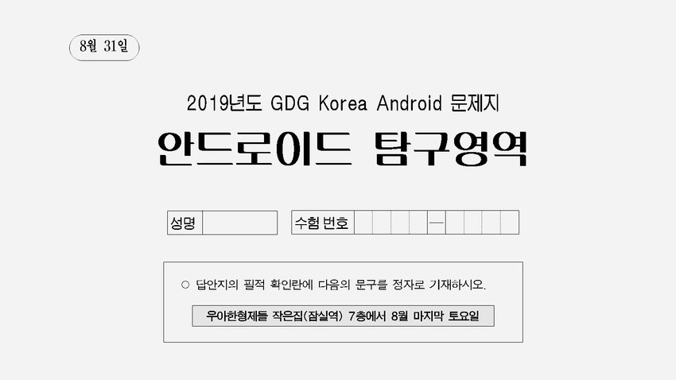

# 안드로이드 탐구영역

- ⏰ 일시 : 2019. 08. 31 (토)
- 💁 주최 : GDG Korea Android
- ⛳ 장소 : 우아한형제들 작은집 7층
- 🔗 링크 : https://festa.io/events/441

## 👏 총평 

- 테스트의 중요성과 방향에 대해서 다시 한번 깨닫게 해준 행사.
- 정작 테스트 가능한 설계와 어떤 테스트를 어떻게 구체적으로 할 수 있는지와 샘플코드는 얻지 못해서 이부분은 개인적으로 아쉬웠다.

## 발표자료

- [GDG And Kor] 아장아장 테스트 첫걸음
https://www.slideshare.net/WooseopKim3/gdg-and-kor

- GDG Android - 좀 더 쉬운 UI 테스트하기 위한 작업을 해보았다.
https://speakerdeck.com/taehwandev/gdg-android-jom-deo-swiun-ui-teseuteuhagi-wihan-jageobeul-haeboassda

## 💯시험지

- 안드로이드 테스트 관련하여 간단한 시험지를 배포했다. 난이도는 꽤 높은편...
- 🔗 링크 : https://drive.google.com/file/d/17Rh1P1SiSDbb1yj2WzaXfZKoClmypoDN/view
