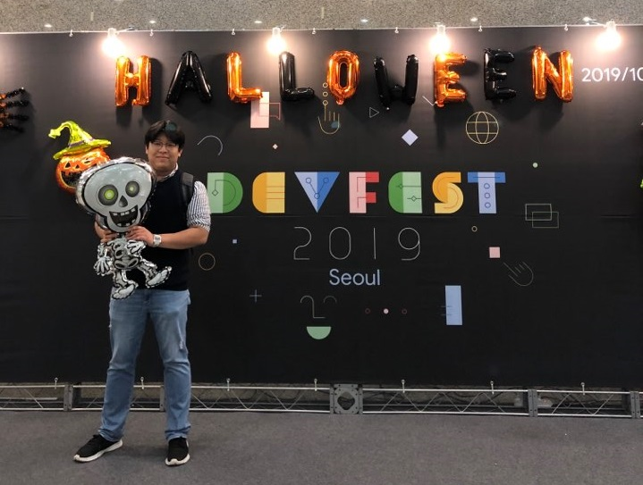

# GDG DevFest Seoul 2019


- ⏰ 일시 : 2019. 10. 20 (일)
- 💁 주최 : GDG SEOUL
- ⛳ 장소 : 세종대학교 광개토관 지하2층 컨벤션홀
- 🔗 링크 : https://festa.io/events/559

## 👏 총평 

- DevFest란 이름에 걸맞게 볼거리 즐길거리가 많은 행사였다.
- 개인적으로는 세션도 세션이지만, GitHub PR로 [방명록](https://gdg-seoul.github.io/DevFest-Seoul-2019-guestbook/)을 받는 이벤트가 가장 인상깊었다.

## 📸 인증샷



## 메모
```
테스터블 아키텍쳐 - 이승민 뱅크샐러드

테스트의 원리
원하는 값의 assert 가 true
verify 가 true

테스트를 어렵게 하는 것
- 의존 클래스의 동작
-> 모킹해서 해결
-> 어떤 변환갑슬 기즐 것인지 에 대한 스텁과 모킹을 이용하여 선언

안드로이드 의존 동작
- 안드로이드 의존성이 있으면 테스트 불가
- wrapping, mocking으로 테스트 해결

아키텍쳐란?
코드의 역할을 분리 : 재사용성을 높임(높은 응집도), 변경 유연하게(낮은 결합도)

원칙1.
모든 의존성 객체를 주입받는다.
프레젠터가 직업 레포지토리를 생성하여 가지면 목업레포지토리 주입 불가
-> 생성자에서 레포지토리를 받는다.
-> 엥 그럼 액티비티가 데이터를 참조하는데?
-> DI를 이용한다.
static은 자제
static 이 있으면 목업 불가

원칙2.안드 의존 동작을 wrapping한다.
-> SDK등 뷰는 전부 래핑한다.
-> view는 인터페이스로 끊는다.

원칙3. 모든 동작은 presenter를 통한다.
버튼을 누르면 다른 뷰를 바꾼다? -> 액티비티 안에서만 해결 가능하지 않아?
-> presenter.oncreate()와 같은 식으로 불필요한것도 전부 프레젠터에 넣는다.
-> passive View 로 구성한다. (MVVM도 마찬가지다)


그럼 실제동작을 위해서 UI 테스트와 DB테스트는?

쉐어드레퍼런스 -> InstrumentationRegistry 를 이용하여 context를 획득하여 테스트한다!

테스터블 컬쳐를 만든다!
QA로 검증하는 것이 빠르다고 느껴진다. 테스트를 추가할 시간이 없다.
=> 테스트의 효용성을 모르겠다. 일정이 바빠 동기가 살지 않는다.


codecov
깃헙 플러그인; PR마다 커버리지 리포트
익숙해지기까지 강제성을 두자 : 커버리지가 이전보다 높지 않으면 Don't approve
```