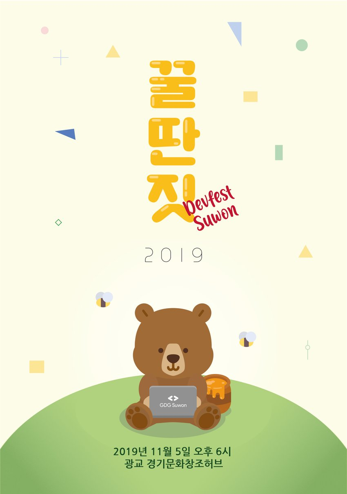
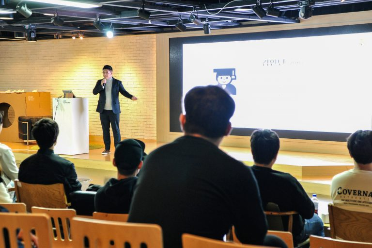
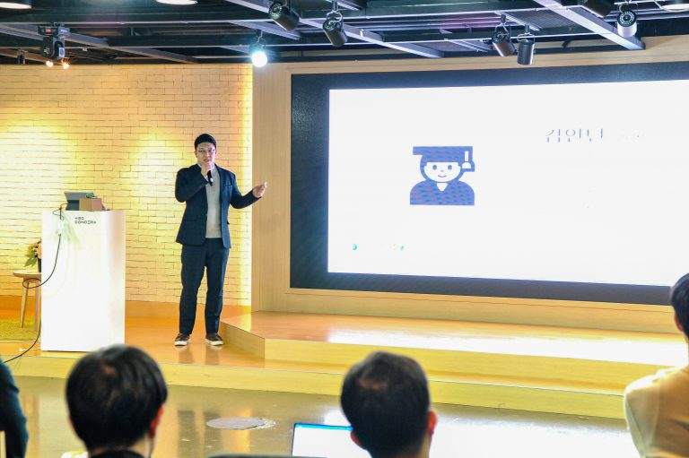
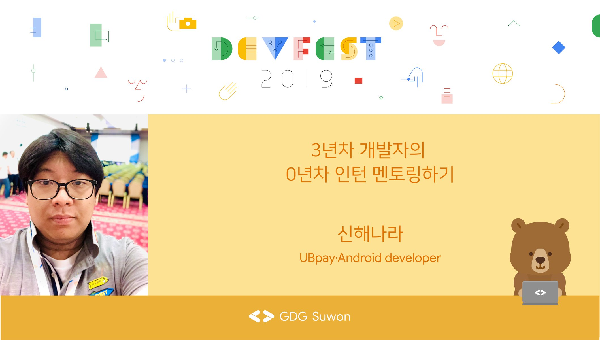

# GDG DevFest Suwon 2019: 개발자의 딴 짓

- **⏰ 일시** : 2019. 11. 05 (화)
- **💁 주최** : GDG Suwon
- **📝 장소** : 광교 경기문화창조허브
- **📝 총평** : 나의 개발자로서 첫 발표를 한 자리
- **🔗 링크** : https://festa.io/events/623

## 👏 총평

- '개발자의 딴짓'이라는 주제로 다양하고 재밌는 주제가 많이 나왔다. 
- 아주 딥하게 기술적인 얘기보다는 주로 커리어나 토이프로젝트같은 이야기였는데도 내용들이 좋아서 도움이 많이 되었다.
- GDG 수원은 언제 어디서 받아보지 못할 상품을 준다는데.. 이번엔 주제인 '꿀딴짓'에 걸맞는 진짜 꿀단지를 주셨다.. 정말로 꿀이 들어 있는....
- 곰돌이 마스코트가 너무 귀여워서 포스터도 받아왔다.
- 나도 개발자로서 첫 발표를 선보인 자리여서 너무나도 의미가 깊다.

## 📸 인증샷

## 0. Keynote

- 🎤 발표자 : 윤재석 GDG Suwon Organaizer
- 📎 발표자료 : [다운로드](https://speakerdeck.com/gdg/gdg-devfest-suwon-2019-keynote)
- ✏️ 요약 
  - DevFest Suwon의 주제 '꿀딴짓'의 의미와 기획의도
  - DevFest Suwon의 다사다난했던 준비과정(직장인이자 부모로서 시간 내는 것이 어려웠다는 점이 누구보다도 공감되는...)
  - 개발자의 딴짓의 중요성
  - 윤재석님의 딴짓 -> 비개발자 개발자 만들기 (빅스비 선한 영향력)

## 1. 공대생들끼리만 나가는 공모전

- 🎤 발표자 : 부현식 삼성전자
- ✏️ 요약 
  - 대학교 동아리 후배들과 공모전에 참가했던 경험담.
  - 공모전과 스터디의 어려움을 함축시킨 발표였다.
  - 실무를 경험한 의욕넘치는 개발자가 참여율 저조한 동아리 후배들을 어떻게 이끌고 결과물을 낸 과정이 묘하게 공감이 되었다..

## 2. Deeplayer: 축구영상 분석 S/W

- 🎤 발표자 : 이용이 SOSLAB
- 📎 발표자료 : [다운로드](https://speakerdeck.com/gdg/gdg-devfest-suwon-2019-iyongi)
- ✏️ 요약 
  - 축구를 좋아하는 공학 대학원생들이 모이면 어떤일이 일어나는지에 대한 경험담
  - 축구 영상 분석을 위해 ML 스터디 과정과 실제로 데이터 수집부터 최종적으로 결과물 도출과 논문 작성까지 간접경험해 볼 수 있는 귀중한 발표였다.
  - 다소 결과물이 아쉬울지라도 이를 커뮤니티 활동으로 풀어내어 GDG Gwangju로 이어나간 것에 대해 다시금 존경을 표한다.

## 3. 퇴근 후 오픈소스 개발자로 성장하기(Feat.멘토링)

- 🎤 발표자 : 배재용 삼성전자
- 📎 발표자료 : [다운로드](https://speakerdeck.com/gdg/gdg-devfest-suwon-2019-baejaeyong)
- ✏️ 요약 
  - 오픈소스 개발 활동을 통해 사내에서 개발 부서로 이동한 경험담
  - 크로미움 오픈소스 프로젝트에 기여한 과정과 이를 통해 사내 개발 커뮤니티까지 활동을 이어나간 이야기
  - 단순히 깃헙을 사용하는 것이 아니라 큰 규모의 오픈소스 프로젝트에 기여한 경험담이어서 도움이 되었다.

## 4. 이 책을 빌릴 수 있을까?

- 🎤 발표자 : 황병렬 JavaScript Developer
- 📎 발표자료 : [다운로드](https://speakerdeck.com/gdg/gdg-suwon-devfest-2019-hwangbyeongryeol-nim)
- ✏️ 요약 
  - 도서관 API를 이용하여 도서관에 대여할 책이 있는지 검색하는 프로그램 개발기 

## 5. 딴짓으로 커리어 바꾸기

- 🎤 발표자 : 조은 NAVER 
- 📎 발표자료 : [다운로드](https://speakerdeck.com/gdg/gdg-devfest-suwon-2019-joeun)
- ✏️ 요약 
  - 퍼블리셔 -> 웹개발자 -> Tech Manager 까지의 커리어를 어떻게 바꿔왔는 지에 대한 경험담
  - GDE 수준의 전문가가 되기 위해서 어떤 노력을 해왔는지에 대해 솔직한 이야기를 들을 수 있어서 의미있었다.
  - 본인이 처한 상황과 성장여부를 리뷰하는 점을 배우고 싶었다.

## 6. 3년차 개발자의 0년차 인턴 멘토링하기

- 🎤 발표자 : 신해나라 UBpay
- 📎 발표자료 : [다운로드](https://speakerdeck.com/gdg/gdg-devfest-suwon-2019-sinhaenara)
- ✏️ 요약 
  - 나의 첫 발표였다! 너무 긴장되서 무슨 말을 했는지 기억이 잘 나지 않는다.
  - 기술적으로 상세한 부연설명이 있었으면 좋았겠다는 리뷰를 받았다. 

### 발표 내용

- 3년차 쥬니어 개발자가 계획에도 없던 인턴 멘토링을 자진하여 함께 삽질한 경험과 결과적으로 개발한 ‘당직 SMS 알림 서비스’를 어떻게 개발했는지 과정과 함께 설명 합니다. 
- 개발자로서 인턴에게 경험하게 해주고자 했던 세가지(프로그래밍, 직장생활 요령, SW개발 라이프사이클)를 중심으로 경험담을 솔직하고 담백하게 (그리고 재밌게) 공유하였습니다. 
- 기술적으로는 파이썬, 구글시트 api, sms 발송 서비스를 어떻게 왜 연동하게 되었는지를 소개하였습니다. 
- 마지막으로 멘토로써 가르치며 스스로를 돌아보고 반성하게 된 점에 대해서 이야기 합니다.

