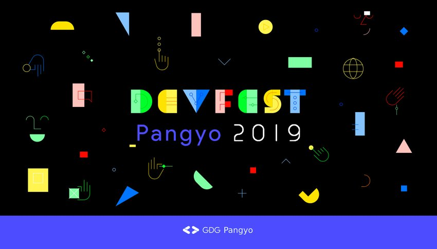
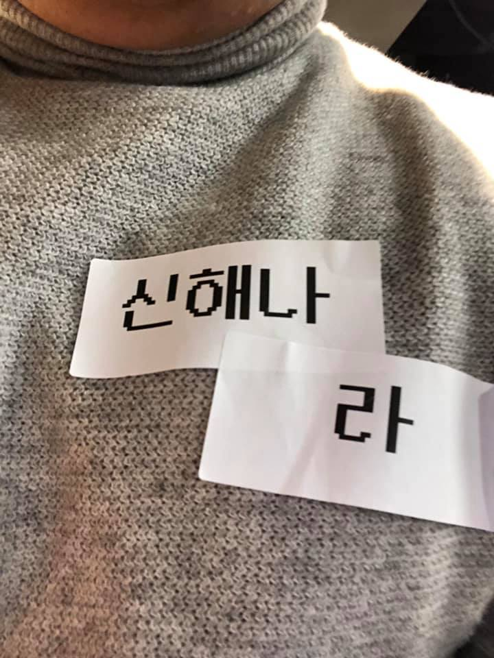

# DevFest Pangyo 2019 : Fun Thing is Good!

- **⏰ 일시** : 2019. 11. 15 (금)
- **💁 주최** : GDG Pangyo
- **📝 장소** : Kakao 판교오피스
- **📝 총평** : 다양한 주제와 즐길거리로 즐거운 행사였다.
- **🔗 링크** : https://festa.io/events/764

## 👏 총평

- 즐길 거리도 많고, 맥주도 시원하고, 내용도 알차서 즐거운 행사였다.

## 📸 인증샷

## 1. ML을 여행하는 안드로이드 히치하이커를 위한 안내서

- 🎤 발표자 : 안성용
- ✏️ 요약 
  - 안드로이드 개발자에게 멀게만 느껴졌던 ML을 시작하는 방법과 주의할 점들

## 2. Stetho의 후계자 Flipper 다루기

- 🎤 발표자 : 안세원
- ✏️ 요약 
  - 앱 디버깅 프레임워크 Flipper 소개와 활용법, 그리고 사용하면서 겪었던 문제 공유
  - Flipper 는 별도의 application 을 이용하고 iOS도 사용할 수 있다는 장점이 있지만, TypeScript로 플러그인을 별도 개발해야 한다는 단점이 있다.

## 3. 최신 AndroidX 체크

- 🎤 발표자 : 노현석
- ✏️ 요약 : 신규 AndroidX 기능들 톺아보기

## 4. 함수 이어서 사용하는 방법으로 자바스크립트 게임 만들기

- 🎤 발표자 : 황병렬
- ✏️ 요약 : 함수를 이어서 마치 *'함수형 프로그래밍'*처럼 Declarative하게 개발하는 방법과 시연

## 5. 후순봇의 시니어 개발자 101

- 🎤 발표자 : 황후순
- ✏️ 요약 : 시니어 개발자가 제안하는 개발자 성장법

## 6. 커뮤니티에서의 다양성

- 🎤 발표자 : 하현주
- ✏️ 요약 : 개발자 커뮤니티에서 다양성의 필요성과 여러가지 관점을 경험담을 통해 공유
