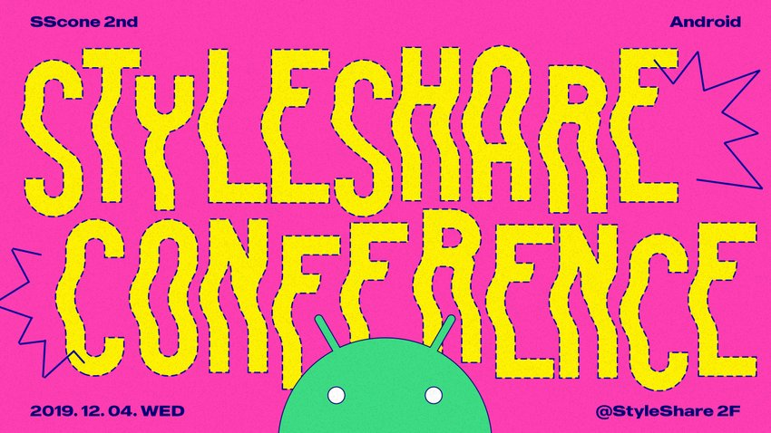
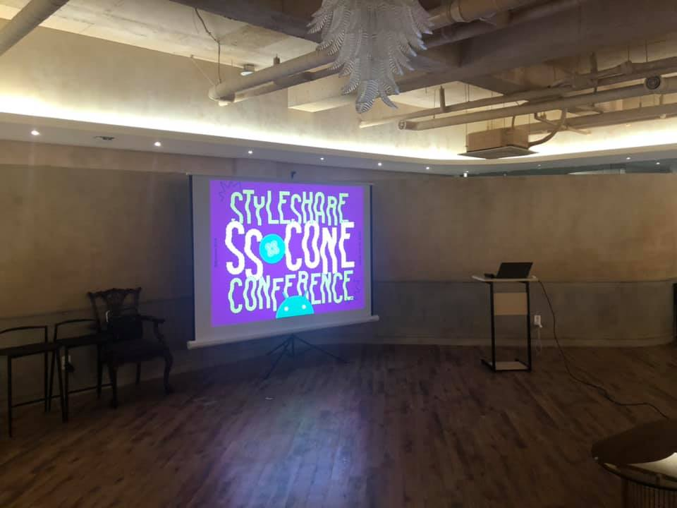

# 스타일쉐어 컨퍼런스 2회 - Android

- ⏰ 일시 : 2019. 12. 04
- 💁 주최 : StyleShare
- ⛳ 장소 : StyleShare 2층 커뮤니티 라운지
- 🔗 링크 : https://festa.io/events/764

## 👏 총평

- 클라이언트 개발자로서 고민하던 문제들을 부담스럽지 않게 공유하는 자리로서 소화하기에 좋았던 것 같다.
- 생각보다 좋은 정보들을 많이 얻어 갈 수 있었다.

## 📸 인증샷

## 1. 내 안의 가짜를 부수고 진짜 사용자를 만나는 방법

- 🎤 발표자 : 최윤석
- ✏️ 요약 
  - 개발자가 UX 분석을 시작하는 방법과 그 과정을 통해 배운 점들

## 2. 멀티모듈 해본 ssul

- 🎤 발표자 : 이길현
- ✏️ 요약 
  - 안드로이드 멀티모듈로 프로젝트를 리팩토링하면서 겪었던 경험담과 그 과정 속에서 배운 점을 공유

### 질문

- Q. 의존성 분리 외에 멀티모듈 자체의 이점이 있는지?
- A. 빌드 속도 개선 등은 체감은 어렵지만 기능 분리만으로도 충분히 이점이 있다고 생각한다.

## 3. Declarative UI의 이론과 실제

- 🎤 발표자 : 윤승용
- ✏️ 요약 
  - Declarative UI 의 개념과 실제로 적용해본 경험담 공유
  - 드디어 Flutter가 아닌 Declarative UI 사례라서 의미가 깊었다.

