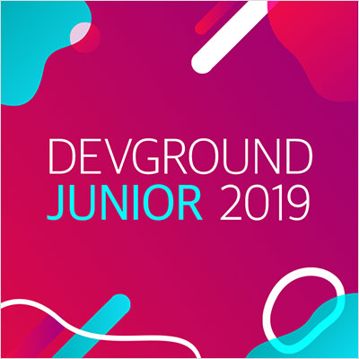
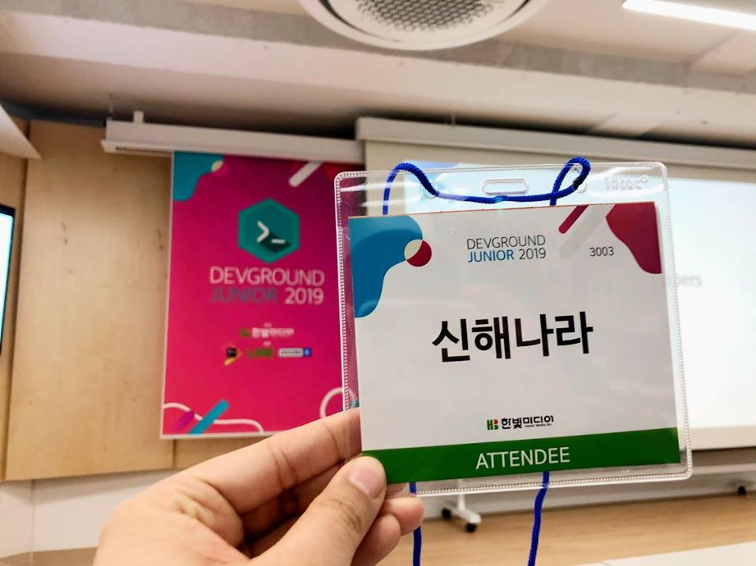

# DEVGROUND JUNIOR 2019

- ⏰ 일시 : 2019. 12. 13 
- 💁 주최 : 한빛미디어
- ⛳ 장소 : 한빛빌딩 리더스홀
- 🔗 링크 : http://devground.hanbit.co.kr/

## 👏 총평

- 키노트 발표에서 말한대로 '산을 먼저 올라가본 사람들의 조언' 이라는 의미가 잘 맞았던 것 같다. 시행착오를 통해 배울 수 있는 것도 많지만, 그것이 시행착오를 겪어야만 배울 수 있다는 의미는 아니니까
- 기대했던 것 보다 연사자분들이 빵빵하신 분들이 많이 와서 배울 것이 많은 귀중한 경험이었다.
- 개인적으로는 첫발표와 마지막 발표가 너무 인상 깊었다.

## 인증샷

## 1. 개발자가 갖추어야 할 9가지 기술

- 🎤 발표자 : 박종천 삼성전자
- ✏️ 요약 : 개발자가 알아야 할 업무 프로세스와 협업의 상식들

### 메모

- 개발 사이클 : 모든 스텝이 1:1:1:1:1 의 비중을 가지게 된다.
- 팀 관리
  - Forming > Storming > Norming > Performing
  - 엔지니어의 역할 : Failure Preventer 
- 프로세스
  - *조엘 테스트*
  - PMMM 5단계
    - 1단계 : Initial -> 같은 용어를 사용함
    - 2단계 : Repeatable -> 같은 프로세스
    - 3단계 : Defined -> 같은 방법론
    - 4단계 : Managed -> 벤치마킹, 평가
    - 5단계 : Optimized -> 위 단계를 지속

### 질의응답

- Q. 팀 매니지먼트 단계별 소요시간과 빨리 넘어가는 요령이 있다면?
- A. 절대 이 단계에 대해 언급하지 말고 천천히 지켜보는 것이 중요함. 
- A. 경험적으로 보아 미국에서는 잘 짜여진 역량있는 조직때 보통 4단계까지 가는데 3개월 정도 걸림. 
- *형님 리더쉽*
- Q. 개발자 자기개발 요령
- A. 시간 관리가 제일중요 (시간 == 돈)
  - spending vs wasting vs invest

## 2. 해외에서 데이터 기업 성장시키기

- 🎤 발표자 : 서하연 Data entrepreneur
- 📎 발표자료 : [다운로드](https://drive.google.com/open?id=1194UGOWwCA_Nrkf0LkCkruod-CTENrOl)
- ✏️ 요약 : 데이터 분석과 주니어 개발자로 아웃풋을 내는 방법

### 메모

- 스타트업으로 사람 뽑기가 너무 어려워 
  - 주니어들을 뽑아서 일 잘 할 수 있는 환경을 만듬.

- 스타트업의 문제
 - 자원(사람)이 부족
   - 팀워크, 협업의 중요성을 강조
   - 업무의 자동화 : 2번이상 요청이 들어오면 반드시 자동화
 - 일정은 항상 촉박
   - 자발적 데드라인 : 언제까지 할건지 담당자가 먼저
   - 업무를 Lean 하게 
   - 주기적인 해우소 운영
   - 작은 Task 일정 관리는 빡빡하게, 큰 Job은 유연하게
 - **실수를 피할 수 없음**
   - 실수 노트 만들고 공유하기
   - 왜 실수했는지, 어떻게 해결했는지를 wiki로 작성하여 서로 공유

## 3. 내가 주니어 개발자 때 알았더라면 좋았을 것들 

- 🎤 발표자 : 김태현, 정도현 AWS코리아
- ✏️ 요약 
  - 김태현 : 7번의 이직과정에서 배운점 => 해외로 나가보자
  - 정도현 : 무엇을 공부하는게 좋을까

### 메모

- 김태현
  - 글로벌 회사에 지원해보자
  - [LeetCode](https://leetcode.com) 
    - medium 수준의 문제 1개를 20분안에 풀 수 있다면 OK
  - 스크립트 언어가 편하다!
  - 영어공부는 필수!

- 정도현
  - Learn and Be Curious, Dive Deep
    - 호기심이야 말로 개발의 원천
  - 멋진 이력을 가지는 방법
    - http://bit.ly/resume4developer
    - 현재의 이력서와 미래의 희망 이력서를 같이 유지한다.
  - 글쓰기와 개발자
    - 좋은 개발자 == 좋은 작가
    - 코딩호러가 들려주는 진짜 소프트웨어 개발 이야기
    - 조엘 온 소프트웨어
  - 최고의 학습법 
    - 다른사람을 가르치는 것이 가장 좋은 학습법이다.
    - 개발자 커뮤니티

### 질의응답

- Q. 아이가 있어도 해외 취업이 어렵지 않을까요?
- A. 어려운 것은 사실이나, 교육을 위해서 해외취업을 선택하는 경우도 있음.

## 4. 성장을 바라는 프론트엔드 개발자를 위한 제언

- 🎤 발표자 : 김민태 우아한 형제들
- 📎 발표자료 : [다운로드](https://drive.google.com/open?id=1DMi6J1U34ZJ0GgPqaec9AyLK3R4irvZn)
- ✏️ 요약 : 개발자의 성장에 대한 고찰

### 메모

- 내가 생각하는 성장 vs 내가 상상하는 성장
- 나만의 성장 전략이 필요하다
- 커리어 관리는 마라톤이다 -> 조급해지면 안된다.
- 목표와 지표를 구체적으로, 평가가능하게 설정한다.
  - 구체화 하지 않으면 달성가능하지 않다.
- 자신의 단점을 정확히 알고 있어야 멘토링도 의미가 있다.
- 자가학습 상태가 되어야 성장할 수 있다.
  - 혼자서 스스로 배우고 성장할 수 있는 상태 (홀로서기)

## 5. 오픈소스 속에서 성장하기 

- 🎤 발표자 : 강대명 유데미
- 📎 발표자료 : [다운로드](https://drive.google.com/open?id=1GeqJCIsyCzmF6SbawHdBt3fbFyRJvJDl)
- ✏️ 요약 : 오픈소스 해야 하는 이유와 쉽게 시작하는 요령 

### 메모

- 주니어의 고민 : 어떻게 하면 성장할 수 있을까?
- 중니어의 고민 : 어떻게 하면 성장할 수 있을까?
- 시니어의 고민 : 내 성장이 멈춘건 아닐까?
- 독서, 컨퍼런스, 토이프로젝트 등...
- 오픈소스를 통해 다양한 경험을 미리 해볼 수 있다.
- 내가 쓰는 오픈소스 프로젝트에 기여해보자
  - 더 자주보고, 더 많이 알고, 더 빨리 알 수 있다.
  - 학습이 업무지식에도 도움이 된다.
   
## 6. 내가 미리 았았으면 좋았을 개발 생활 팁

- 🎤 발표자 : 강윤신 라인파이낸셜플러스
- 📎 발표자료 : [다운로드](https://drive.google.com/open?id=1794ckEANEWrJo44lPPSp1m-SnAr3X6A4)
- ✏️ 요약 : 개발자의 질문 잘 하는 법

### 메모

- 내 문제를 이해 하자 -> 내가 정의한 문제가 무엇인지
- 고맥락, 저맥락에 맞춰 대화
- 프로그래밍 용어, 업무 관련 용어
- 개발자가 갖춰야할 세가지 위대한 덕목
  - 나태 
  - 조바심
  - 자만심

## 7. 홀로 성장하는 시대는 끝났다.

- 🎤 발표자 : 이소영 한국마이크로소프트
- ✏️ 요약 : 커뮤니티 리더들의 공통된 특성인 커뮤니티 리더십이 무엇인지 소개하고 이를 통해 개발자 커뮤니티 활동의 중요성 강조.

### 메모

- 커뮤니티 리더십?
  - MS MVP들의 공통된 특징
  - 지식을 나누고 공동체의 성장을 도와 **사람들이 자발적으로 내 의견이나 정보에 귀 기울이게 만드는 능력**
- 실패를 많이 겪어야 성공할 수 있다.
  - 실패를 통해 교훈을 많이 얻을 수록 성공에 가까워진다.
  - 즐겁게 버텨내는 힘이 필요하다. => 커뮤니티 공부
- 성장하는 자세 
  - 학습과 도전을 즐김
  - 본인과 다른사람들의 성장에 기여
- 커뮤니티 공부 효율성의 비밀
  - Learning Pyramid
  - 현장감 있는 공부
  - 인적 네트워크
  - [커뮤니티에서 길을 찾은 사람들](https://www.facebook.com/groups/CommunityGCS/)

## 8. AI/데이터 시대를 사는 개발자를 위한 생존가이드

- 🎤 발표자 : 임백준 삼성전자
- ✏️ 요약 : 다가오는 인공지능 기술에 따른 시대의 변화와 개발자가 인공지능 시대를 준비하고 대비하는 방법을 소개. 개인적으로는 가장 인상 깊었던 발표.
- 🔗 참고 링크 : [[Bixby Developer Day 2019: Session] AI, 데이터 시대를 사는 소프트웨어 개발자를 위한 생존 가이드](https://www.youtube.com/watch?v=wqA2oVZsaBg)

### 메모

- [Humans Need Not Apply](https://www.youtube.com/watch?v=7Pq-S557XQU)
  - 제리 카플란
  - 인조지능과 인조노동자의 탄생
  - 관리와 통제의 상실, 부의 편중, 일자리 상실
  - 무용계급(useless class)의 출현
- **Software 2.0**
  - Andrej Karpathy
  - 1.0은 프로그래밍 언어를 통해 명령어를 명시적으로 전달
  - 뉴럴 네트워크의 웨이트처럼 데이터만 전달하면 컴퓨터가 로직을 직접 구현
- 생존 가이드
- Fundimental을 공부하라
  - 유행하는 프래임워크, API의 수명은 길어봐야 3년
  - 객체지향, 함수형, TDD, 리팩토링, 패턴 등 원리와 패러다임은 10년 이상
  - 인간 자체의 문제 해결 능력 
- Fundimental을 성장시키는 올바른 습관과 태도
  - Fake it till you make it (겁내지 말고 일단 밀어넣자)
  - Job vs Career (지금의 Job을 보지 말고 인생의 Career를 보라)
  - People skills (사람 다루는게 갈수록 더 중요해진다)
  - Add value to others (기여하라)
  - Don't be afraid to look like an idiot 
- 전자레인지를 사용하기 위해 전자공학을 공부할 필요는 없다.
  - Cassie Kozyrkov
  - 머신러닝에 대해 처음부터 만드는 법을 배울 필요가 없다.
  - 머신러닝 알고리즘을 개발하는과 활용하는 것은 다르다. 합리적인 테스트 방법이 있다면 머신러닝을 블랙박스처럼 다뤄도 좋다.
  - 프로그래밍의 본질은 문제를 해결하는 것 = 팝콘을 튀기는 것 

  
### 질의응답 

- Q. 문제해결능력이 중요한데, 이걸 잘 하는 사람은 어떻게 찾을 수 있고, 또 이걸 잘한다고 어떻게 증명할 수 있을까요?
- A. 일반화 하긴 어렵지만, 자신감이 있어야한다. 당당한 태도와 솔직하고 시원시원한 대답이 도움이 될 수 있다.

- Q. Fundimental 을 어떻게 키울 수 있을까?
- A. 역시 일반화하기 어렵지만 태도, 커뮤니케이션, 자존감 세가지가 제일 중요하다. 책읽고 여행다닌 일반적인 답변이 예시가 될 수 있겠지만 무엇보다도 태도와 자존감이 제일 중요하다.
