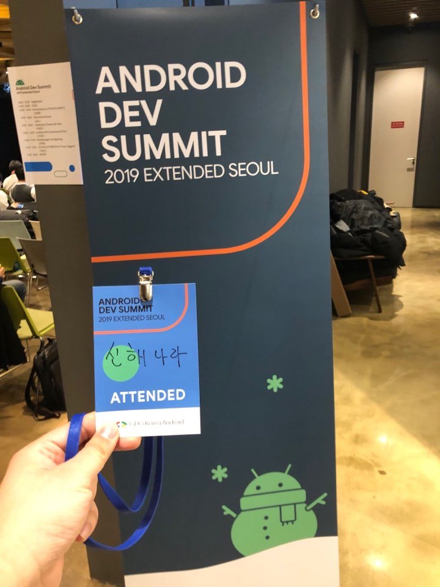

# ANDROID DEV SUMMIT 2019 EXNTENDED SEOUL

- ⏰ 일시 : 2019. 12. 21 (토)
- 💁 주최 : GDG Korea Android
- ⛳ 장소 : Google Campus for Startups
- 🔗 링크 : https://festa.io/events/744

## 👏 총평

- 최근에 고민하던 테크니컬한 문제들에 대한 해답을 들을 수 있는 단비같은 행사였다.
- 개인적으로 컨디션이 나쁜 상태였는데 안왔으면 후회할 뻔 했다.

## 📸 인증샷

## 1. Android Security

- 🎤 발표자 : 권태환 카카오페이
- 📎 발표자료 : [다운로드](https://speakerdeck.com/taehwandev/android-security-security-library-biometric-auth?fbclid=IwAR0gWZiM3DS2mqK-bE-lLFNt2GjbJ3Argd9uDOElFzIogx_B6UMP-oDuj5o)
- ✏️ 요약 
  - AndroidX Security Library 소개
  - 당장 어제 이거 쓰다 왔는데.. 반갑기도 하고 묘하기도 하고..

### 메모

- Android Security Library 개요
  - MinSDK 23 
  - alpha2 
  - 암호화 관련(파일 관련, KeyAlias 생성)
  - **네트워크나 DB는 지원하는 라이브러리가 없다.**

- Google Tink를 사용하고 있다.
  - 우리가 암호화 검색하면 나오는 '그 코드'가 들어있다.
- EncryptedSharedPreferences
  - 생성만 달라지고 나머지 읽고 쓰는 코드는 동일하다.
  - KeyAlias 만 주의하면 된다. (바뀌면 못 복호화를 못하니까)
- EncryptedFile
  - 생섬만 달라지고 bufferRead, bufferWrite 그대로 쓴다. 
- 주의사항
  - masterKeyAlias는 String 변수이다.
  - 변경가능하고 동작에 문제는 없지만, MasterKeys 사용을 권장.
- EncryptedFile 은 동일한 이름의 파일에 덮어씌울 수 없으므로 주의한다.
- Biometric Authentication
  - 지문인식, 얼굴인식 등 생체인식
  - MinSdk 23
  - 팝업이 뜬다. 
  - 얼굴인식은 최종 컨펌을 받는다.(픽셀 버그때문인가?)
  - 지문인식만 쓸 수 없다. (개발자가 지정하지 못하고 사용자가 설정한 생체인식 방식이 뜬다.) 

- 보안 자체에 대한 내용은 별도의 학습이 필요할 수도 있겠다는 생각이 든다.

### 질의응답

- Q. KeyAlias 는 디바이스 수준인지? 설치 수준인지?
- A. 설치수준

## 2. New in Android Studio

- 🎤 발표자 : 노현석 네이버
- 📎 발표자료 : [다운로드](https://speakerdeck.com/pluu/new-in-android-studio)
- ✏️ 요약 
  - 안드로이드 스튜디오 v3.6 및 v4.0 의 새로운 기능 소개
  - 언제나처럼 빠르고 알찬 내용들이었다. 나중에 따로 발표자료 보면서 복습해야지...

### 메모

- 4.0 에서 build.gradle 
  - 디펜던시 새로운 버전 찾는 기능 개선
- BuildSpeed 
  - 어디서 빌드 시간을 잡아먹는지 시각적으로 확인 가능
  - 빌드속도 개선 및 확인 가능
- Multi Preview
  - 멀티 디바이스, 멀티 Locale, Color Blind Mode 등 
  - Split View 버튼위치가 좌하단에서 우측상단으로 변경
- Desugraring
  - 최소 API Level을 요구하지 않고 Java 8 API 사용가능
  - 별도의 Library 를 사용하는 방식으로 쓰게 된다.
  - build.gradle 에서 설정 coreLibraryDesugaringEnabled 를 사용하면 쓸 수 있다.
- View Binding 
  - findViewById 대체 가능
    - 잘못된 ID로 인한 NPE 발생 우려가 없다.
  - 데이터바인딩 마냥 xml을 가지고 뷰에 대한 코드가 생성되어 참조 가능. 
  - 데이터바인딩과 사용방법도 비슷
  - 데이터바인딩 처럼 수식은 불가능.
- Android Jetpack Compose
  - Declaritive UI 
  - Preview도 지원
    - 다크모드, 상태에 따른 변화도 전부 볼 수 있다.
  - pre alpha 이므로
- Debugging 
  - 디버깅 중 브레이크포인트 라인을 지나쳤을 때?
  - ApplyChange 를 이용하면 디버깅 중에 코드 수정 가능
- Layout Inspector
  - MotionLayout 등 레이아웃을 3D뷰로 볼 수도 있다. 
- Motion Editor
  - ConstaintLayout을 MotionLayout으로 컨버트 가능.

## 3. Developing Themes with Style

- 🎤 발표자 : 안명욱 카카오
- ✏️ 요약 
  - 머테리얼 디자인을 적용을 위한 테마사용법

### 메모

- 재사용이 가능한 
- 테마 VS 스타일
  - 스타일은 뷰의 속성들을 각각 뷰마다 설정 
  - 테마는 뷰속성이 아닌 테마속성을 키로 사용한다.
  - 테마를 참조할 때는 ?attr/ 로 사용 (?는 현재 테마)
- 테마는 컨텍스트와 연결된다 
  - closestViewContext를 이용하여 사용가능.
- 테마는 계층구조를 가진다.
  - 테마를 뷰에 적용하면 하위뷰에 전부 적용 된다.
  - 테마도 상속되고, 자식이 속성을 override 하여 사용한다.
  - 테마 오버레이를 이용하여 변경되는 속성만 선언하여 사용할 수 있다.
  - 다크모드에서 라이트모드를 오버레이 하여 특정부분만 라이트모드로 보여주는 등의 유연한 활용이 가능하다.
- 테마를 사용하는 스타일, 스타일을 사용하는 테마도 가능
- 컬러태그에서는 다른 컬러태그를 참조할 수 있지만 테마는 참조불가
- Color state list를 이용하여 Stateful Wrapper처럼 상태에 따라 다른 색상을 설정하는 방법도 있다.
- color state list에서 위에서부터 우선순위를 가지므로 유의
- 알파값만 다른 color 를 여러개 선언하는 대신 color statelist 를 이용하여 알파값만 넘겨서 사용할 수 있다.
- 구글에서 권장하는 것은 문자그대로의 이름을 사용하기를 권장
  - O : blue_500, pink_250, ...
  - X : primary, primary_dark, ...
- 스타일 이름을 . 으로 단위별로 네이밍하면 암시적 상속 가능

- 다크테마
  - AppCompat에서 어느것을 사용할 것인지 설정
  - 스타일에서 하드코딩 된 색상이 있다면 문제가 생기기 마련

## 4. LiveData with Coroutines and Flow

- 🎤 발표자 : 이우춘 카카오페이
- ✏️ 요약 
  - LiveData를 이용한 MVVM 구조에서 코루틴 활용법 

### 메모

- 사람마다 Layered architecture 에 관점과 구현체가 다르다.
- Scope 설정을 명확하게 잘 쓰는것이 협업상 좋다.
- LifecycleScope 
- ApplicationScope or WorkManager
- 아.. 코루틴 공부해야겠다...

## 5. WorkManager: the Beginning

- 🎤 발표자 : 안성용 네이버
- 📎 발표자료 : [다운로드](https://speakerdeck.com/fornewid/workmanager-the-beginning)
- ✏️ 요약 
  - 워크매니저가 나오게 된 배경부터 사용법과 버전별 지원기능들 소개

### 메모

- Before WorkManager
  - AlarmManager
  - JobScheduler
  - Doze Mode
  - GCMNetworkManager
  - android-job
  - JobDispatcher
- WorkManager 
  - AlarmManager + JobScehduler (+GCM)
  - 제트팩
  - WorkManager DB에 
    - DB에 저장하기때문에 강제종료를 해도 리스케쥴가능
  - enqueue 도 있지만 체이닝도 가능 (비기닝with)
  - 조건에 맞게 cancel도 가능 (이름, id, tAg)
- Worker
  - Worker, RxWorker, CoroutineWorker
- Initializer
  - ContentProvider 라서 Application oncreate 이전에 실행
  - On Demand로 실행도 가능
- Worker Progress
  - 결과 뿐 아니라 progress 도 전달 가능 
  - setProgress로 프로그레스를 설정하고 이걸 받아서 처리하면 UI적으로 처리 가능하다.
  - worker가 running state일때만 사용하도록 유의한다.
- Foreground Worker
  - 오래걸리는 작업은 포어그라운드로 넘겨서 사용자에게 명시가능하고 중간에 취소도 가능하다.
  - setForeground 로 Notifictaion 설정하여 생성 가능.

## 6. 안드로이드 DI 어떻게 하나요? (Feat. Dagger2)

- 🎤 발표자 : 이승민 뱅크샐러드 
- ✏️ 요약 
  - DI가 무엇인지와 DI를 써야하는 이유
  - Koin vs Dagger 비교

### 메모

- DI(의존성 주입)
  - 다른 클래스를 사용하여 발생하는 의존성
  - 객체를 직접 생성해서 쓰는 대신에, 다른곳에서 생성하고 전달받는 것을 의미
- 왜 DI를 써야 하는가?
  - 쉬운 리팩토링
  - 높은 재사용성 
  - 쉬운 테스트 
  - 결론은 **Loosed coupling!!**
- DI 라이브러리 비교
  - Manual DI
    - 결론적으로 액티비티/프래그먼트에서 생성하게 됨
  - Koin
    - Service Locator
    - 런타임에 타입체크를 하는데 이것이 장점이자 단점
  - Dagger
    - Generated Code
    - 컴파일 타입 체크
    - 높은 학습비용
    - 앱 사이즈가 커질수록 유리해진다.
- Dagger 구성
  - Module
  - Bind / Provide
  - Component 
- AndroidInjector
- Google Guide
- Dagger support Kotlin