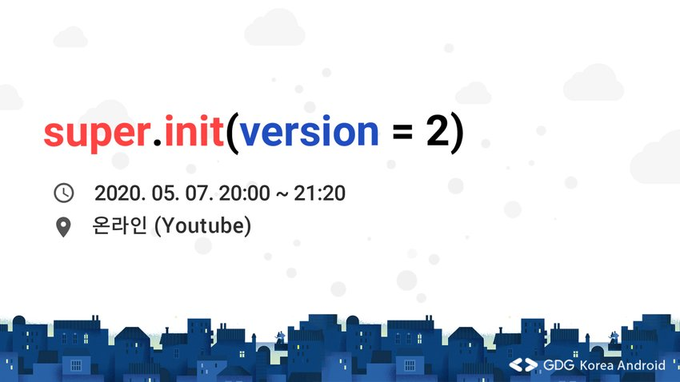
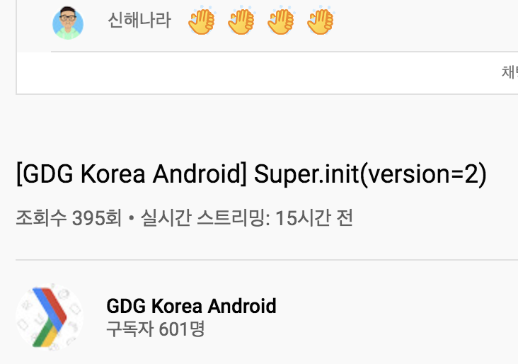

# Super.init(version=2)

- ⏰ 일시 : 2020. 05. 08
- 💁 주최 : GDG Korea Android
- ⛳ 장소 : 온라인 (Youtube)
- 🔗 링크 : https://festa.io/events/987
- 📽️ 영상 : https://www.youtube.com/watch?v=i_0zOxFrAd0

## 👏 총평

- 첫 웹미나로 재밌고 독특한 시간이었다.
- 주니어 개발자로서 비슷한 고민거리를 갖고 있었는데 많은 도움이 되었다.

## 📸 인증샷

> 실시간 채팅 인증

## 1. 근본있는 개발자로 성장하기

- 🎤 발표자 : 김영재 화이트블록
- ✏️ 요약 : 주니어 개발자로서 이직하며 성장 

### 메모

회고(피드백)의 부재로 인한 무근본 성장
-> 프로젝트 끝낼 때마다 회고, 형식을 정하고 작성

기술부채 해결 : 꾸준한 블로그 + 코드 작성

다양한 활동 : 컨퍼런스, 세미나 등 다양한 채널에서 활동

주니어 개발자란? : 회사를 알아가고 기본을 갖추는 시기

### 질의응답

- Q. 이직 이후 관심있는 분야의 개발을 하고 계신지?
- A. 만족하며 다니고 있습니다.

- Q. 회사에 성장 가능성을 어필할 수 있는 방법?
- A. 문제해결 능력 등이 중요한데 GitHub 기여 정도 위주

- Q. 회고와 블로그에 어느정도 시간을 투자하시는지?
- A. 퇴근 후, 주말에 시간을 할애하고 시간이 꽤 소요

- Q. 회고 형식이 어떤식으로, 왜 바뀌어 왔는지?
- A. 기술스택, 후기, 개선사항 등을 작성. 최초에는 일기형식으로 작성했으나 너무 장황해지고 가독성이 떨어져서 공통되는 항목을 묶음

- Q. 본인에게 맞는 회사를 찾는 방법
- A. 회사의 비전, 제품, 개발문화 등 외적인 요소의 꼼꼼한 조사가 필요

## 2. 어서와 코드 리뷰는 처음이지?

- 🎤 발표자 : 신승민 쏘카
- ✏️ 요약 : 쏘카의 코드리뷰 문화 소개와 경험담 공유

### 메모

코드 리뷰 경험 없는 개발자의 코드 리뷰 적응기

쏘카의 경우 오프라인 코드리뷰를 진행
(PR에 대해 컨벤션, 논리의 헛점 등 여러가지 요소 검토)

PR 규칙을 지키는 것이 중요 (브랜치네이밍, 마일스톤, 라벨 등)
개인 브랜치 네이밍 : (닉네임/YYYYMMDD-feature)

설계 리뷰를 통해 이슈 할당 이전에 리뷰단계 추가

- PR을 짧게 유지한다.
아무리 사소해도 별도의 기능 및 버그는 개별 PR로 분리
git rebase를 이용하여 보일러플레이트를 최대한 빼고 실제 기능만 PR로 추려낸다
  
- PR 코멘트
의도를 명확하게 작성, 외부 링크나 세부구현 아이디어를 최대한 많이 작성한다
Markdown 형식이므로 가독성을 높일 수 있도록 작성

- 코드리뷰를 쉽게 보는 법
GitHub 가독성 향상 -> Octotree, GitHub Dark Theme
IDE를 활용하여 코드 확인
오프라인 코드리뷰

### 질의응답

- Q. 코드리뷰에서 부정적으로 받아들이는 팀원에게 어떻게 대처?
- A. 질문 형식으로 유도하거나 부정적인 의도가 아님을 명시

- Q. 코드리뷰에서 완전히 새로 구현해야 하는 의견을 받게 된다면?
- A. 일정을 미루더라도 새로 구현

- Q. PR의 크기 또는 단위를 어떤식으로 결정?
- A. 아직 시행착오를 겪는 중

- Q. 코드 리뷰가 자꾸 미뤄지면 어떻게 대처?
- A. 직접 찾아가서 부탁함
