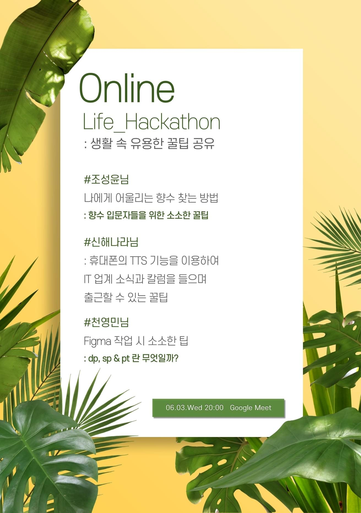

# Online Life Hackathon

- ⏰ 일시 : 2020. 06. 03
- 💁 주최 : Life Hackathon
- ⛳ 장소 : 온라인 (Google Meet)
- 🔗 링크 : https://www.notion.so/Life-Hackathon-901288684ded4ec09277f5b656a2655c?fbclid=IwAR3kh053UEx02Cqxphor8a_bI8MeL_398p2Q8R5ilgjIKQVBIHFyR_sM3CI

## 👏 총평

- 나의 첫 온라인 발표 경험이 된 행사이다.

## 1. 나에게 어울리는 향수 찾는 방법

- 🎤 발표자 : 조성윤 
- ✏️ 요약 : 향수 시향해보는 요령과 향수 브랜드 추천

## 2. 출근길 자면서 공부하기

- 🎤 발표자 : 신해나라 키즈노트
- 📎 발표자료 : [다운로드](https://www.dropbox.com/s/adbl2tsoa6p2shd/%EC%B6%9C%EA%B7%BC%EA%B8%B8%EC%9E%90%EB%A9%B4%EC%84%9C%EA%B3%B5%EB%B6%80_LifeHackathon_%EC%8B%A0%ED%95%B4%EB%82%98%EB%9D%BC2.pdf?dl=0)
- ✏️ 요약 : 휴대폰의 TTS 기능을 이용하여 IT업계 소식과 칼럼을 들으며 출근할 수 있는 꿀팁

## 3. Figma 작업 시 소소한 팁

- 🎤 발표자 : 천영민
- ✏️ 요약 : 디자인 툴 피그마 활용팁과 모바일 해상도 단위인 dp, sp, pt 구분
